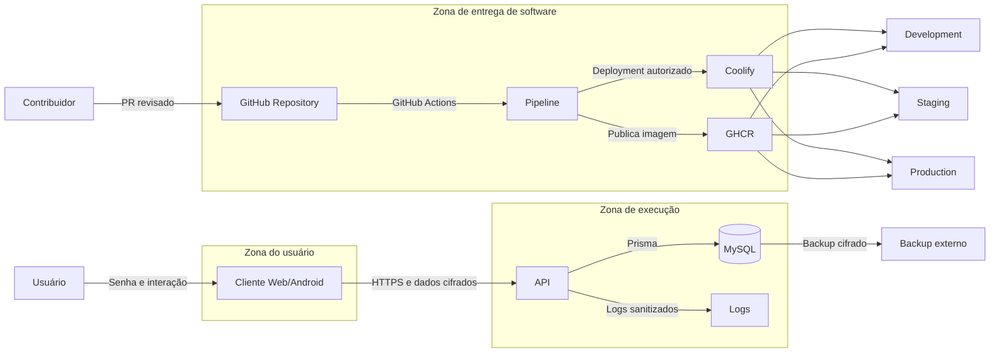

# SECURITY.md

# Crypta — Segurança

> **Status:** Documento inicial para revisão  
> **Versão:** 0.2.0  
> **Última atualização:** 8 de agosto de 2026

---

## Como reportar uma vulnerabilidade

**Não abra uma issue pública.** Uma issue é indexada por buscadores no instante em que é criada.

Use o reporte privado do GitHub:

**[Abrir um advisory privado](https://github.com/VictOliRodrigues/crypta/security/advisories/new)**
— ou, no repositório: aba `Security` → `Report a vulnerability`.

O canal é apenas esse. Não existe endereço de e-mail de segurança para este projeto: um e-mail
publicado em repositório público vira alvo de spam e não oferece o sigilo nem o histórico que o
advisory oferece.

### O que incluir

- descrição do problema;
- impacto: o que um atacante consegue obter ou fazer;
- passos para reproduzir;
- versão ou commit afetado;
- evidência **sanitizada**;
- sugestão de correção, se tiver.

### O que nunca incluir

Nem no reporte, nem em anexo, nem em captura de tela:

- senha, token, cookie ou cabeçalho de autorização reais;
- ciphertext completo de um cofre real;
- chave privada;
- dump ou trecho de banco de produção;
- dados pessoais de terceiros.

Se a evidência exigir algum desses, descreva o formato em vez de colar o valor.

### Prazos

O projeto é mantido por uma pessoa, em tempo parcial. Não há SLA contratual. O compromisso é:

| Etapa                          | Prazo alvo            |
| ------------------------------ | --------------------- |
| Confirmação de recebimento     | 5 dias úteis          |
| Avaliação inicial e severidade | 15 dias úteis         |
| Correção ou plano público      | negociado caso a caso |

Divulgação coordenada: a correção é publicada antes dos detalhes técnicos, e o crédito é dado a
quem reportou, salvo pedido em contrário.

### Escopo

Vale reportar qualquer coisa que quebre o modelo de `ARCHITECTURE.md` secao 14 — em especial
qualquer caminho pelo qual o servidor consiga ler conteúdo de cofre em texto aberto.

Fora de escopo: as limitações já assumidas e documentadas na secao 48 de `ARCHITECTURE.md`
(frontend comprometido, dispositivo comprometido, membro autorizado copiando o que já pode ver,
metadados visíveis ao servidor). Relatar uma delas não é achado; propor mitigação, sim.

---

## 1. Objetivo

Este documento define os requisitos, premissas, controles e limitações de segurança do cofre de senhas.

Deve ser utilizado em conjunto com:

- `PROJECT_SCOPE.md`;
- `ARCHITECTURE.md`;
- `DATABASE.md`;
- `API.md`;
- `TELAS.md`;
- `STYLE_GUIDE.md`.

O sistema armazenará credenciais reais. Portanto, nenhuma funcionalidade deverá ser considerada concluída apenas porque “funciona”.

Ela deverá também:

- proteger confidencialidade;
- preservar integridade;
- validar autorização;
- evitar exposição em logs;
- possuir testes;
- possuir documentação;
- ser validada no ambiente de testes;
- respeitar o modelo criptográfico definido.

---

## 2. Objetivos de segurança

O sistema deverá buscar os seguintes objetivos:

### 2.1 Confidencialidade

Impedir que usuários não autorizados, banco de dados, operadores da VPS ou a API tenham acesso normal ao conteúdo descriptografado dos cofres.

### 2.2 Integridade

Detectar alterações indevidas em:

- payloads;
- chaves;
- envelopes;
- convites;
- sessões;
- versões;
- relações entre recursos.

### 2.3 Isolamento

Garantir que um usuário não consiga acessar:

- cofres privados de outro usuário;
- cofres compartilhados dos quais não seja membro;
- sites de outro cofre;
- credenciais de outro cofre;
- envelopes de outro membro;
- sessões de outro usuário.

### 2.4 Autenticidade

Garantir que as alterações sejam associadas a uma sessão autenticada e autorizada.

### 2.5 Disponibilidade

Reduzir riscos de indisponibilidade causados por:

- falhas de deploy;
- perda do banco;
- abuso de API;
- migrations mal executadas;
- consumo excessivo de recursos;
- exclusão acidental;
- falha de backup.

### 2.6 Auditabilidade

Registrar eventos relevantes sem registrar o conteúdo sensível.

---

## 3. Escopo de segurança

Este documento cobre:

- aplicação Web;
- aplicativo Android;
- API;
- banco MySQL;
- Coolify;
- VPS;
- GitHub;
- pipeline de CI/CD;
- backups;
- importação CSV;
- convites;
- compartilhamento;
- criptografia;
- sessões;
- logs;
- dependências.

Não cobre completamente:

- segurança física dos dispositivos;
- malware no dispositivo do usuário;
- root no Android;
- keylogger;
- comprometimento do navegador;
- comprometimento da conta de GitHub;
- comprometimento do provedor da VPS;
- segurança do canal utilizado para compartilhar convites;
- engenharia social.

---

## 4. Classificação dos ativos

### 4.1 Ativos críticos

- senha de autenticação do usuário;
- `RootKey`;
- `UserEncryptionKey`;
- chave privada do usuário;
- `VaultKey`;
- envelopes de chave;
- credenciais;
- observações;
- refresh tokens;
- segredos de convite;
- chaves de assinatura;
- credenciais do banco;
- chave de assinatura do APK;
- backups.

### 4.2 Ativos sensíveis

- e-mail;
- nome do usuário;
- membership;
- lista de cofres;
- relação entre usuários;
- IP;
- user agent;
- horários de acesso;
- tamanho dos cofres;
- quantidade de credenciais;
- histórico de ações.

### 4.3 Ativos públicos

- código-fonte;
- documentação;
- contratos da API;
- imagens Docker públicas, se adotadas;
- releases;
- changelog.

---

## 5. Atores

### Usuário legítimo

Acessa cofres próprios e compartilhados.

### Proprietário de cofre

Gerencia conteúdo, convites e membros.

### Editor

Gerencia sites e credenciais, mas não membros.

### Operador da infraestrutura

Administra VPS, Coolify, banco e backups.

### Contribuidor externo

Pode ler e propor alterações no repositório público.

### Atacante remoto

Tenta explorar API, autenticação, infraestrutura ou clientes.

### Membro mal-intencionado

Possui acesso legítimo a um cofre compartilhado e pode copiar informações.

### Atacante com banco vazado

Possui dump do MySQL, mas não a senha do usuário.

### Atacante com acesso ao frontend publicado

Pode tentar adulterar arquivos JavaScript entregues ao navegador.

---

## 6. Premissas

A segurança assume que:

- os clientes oficiais não foram modificados;
- o dispositivo do usuário não está comprometido;
- HTTPS está funcionando corretamente;
- segredos do servidor não foram vazados;
- dependências foram revisadas;
- o usuário utiliza senha forte;
- o usuário não compartilha sua senha;
- o convite é transmitido por canal confiável;
- backups são protegidos;
- o APK é obtido de fonte confiável;
- a chave de assinatura do APK permanece segura.

---

## 7. Limitações reconhecidas

### 7.1 JavaScript comprometido

Se a VPS ou o pipeline publicar JavaScript malicioso, o frontend poderá capturar:

- senha;
- chaves;
- credenciais descriptografadas;
- conteúdo importado.

Criptografia no cliente não protege contra cliente malicioso entregue pelo próprio servidor.

### 7.2 Dispositivo comprometido

Malware, root, keylogger, captura de tela ou extensão maliciosa podem expor dados.

### 7.3 Membro autorizado

Um membro pode copiar, fotografar ou registrar informações às quais possui acesso.

Remover o membro não apaga o que ele já obteve.

### 7.4 Metadados

A API ainda conhece:

- contas;
- memberships;
- timestamps;
- IP;
- user agent;
- tamanho de payload;
- frequência de uso;
- quantidade de registros.

### 7.5 Recuperação

Sem senha ou material de recuperação futuro, o usuário poderá perder acesso aos dados.

### 7.6 Memória

Em JavaScript não é possível garantir limpeza segura de memória.

A aplicação deverá reduzir tempo de permanência e referências, mas não poderá prometer zeroização garantida.

---

# PARTE I — MODELO DE AMEAÇAS

---

## 8. Ameaças principais

### 8.1 Vazamento do banco

Risco:

- exposição de hashes;
- envelopes;
- ciphertexts;
- metadados;
- sessões.

Mitigações:

- criptografia no cliente;
- hash forte;
- refresh token hasheado;
- banco não público;
- usuário de privilégio mínimo;
- backup criptografado;
- monitoramento.

### 8.2 Brute force

Risco:

- tentativa de adivinhar senha;
- ataque offline sobre material vazado.

Mitigações:

- Argon2id;
- parâmetros calibrados;
- senha forte;
- rate limit;
- bloqueio progressivo;
- resposta genérica;
- auditoria.

### 8.3 Roubo de sessão

Risco:

- acesso sem conhecer senha.

Mitigações:

- access token curto;
- refresh token rotacionado;
- cookie `HttpOnly`;
- `Secure`;
- Android Keystore;
- revogação;
- detecção de reutilização;
- logout global.

### 8.4 IDOR

Risco:

- usuário altera IDs para acessar recursos de outro usuário.

Mitigações:

- authorization policy;
- query contextualizada por membership;
- testes específicos;
- nunca confiar no frontend.

### 8.5 Alteração de ciphertext

Risco:

- corrupção ou substituição de payload.

Mitigações:

- AEAD;
- AAD;
- versionamento;
- validação de relações;
- falha fechada.

### 8.6 Convite interceptado

Risco:

- terceiro obtém o link.

Mitigações:

- token aleatório;
- segredo no fragmento;
- expiração;
- uso único;
- e-mail autorizado;
- cancelamento;
- auditoria.

### 8.7 Membro removido

Risco:

- continuar acessando dados futuros.

Mitigações:

- membership bloqueado;
- rekey;
- envelopes novos;
- remoção dos envelopes antigos;
- invalidação de snapshots futuros.

### 8.8 Supply chain

Risco:

- dependência maliciosa;
- pacote comprometido;
- action comprometida;
- workflow alterado de forma indevida.

Mitigações:

- lockfile;
- revisão;
- atualização controlada;
- auditoria;
- CI;
- dependências mínimas;
- pinning de Actions;
- rulesets;
- revisão adicional em workflows.

### 8.9 Segredo no GitHub

Risco:

- exposição pública imediata.

Mitigações:

- `.gitignore`;
- `.env.example`;
- secret scanning;
- push protection quando disponível;
- revisão;
- rotação imediata;
- nenhum dado real em documentação.

### 8.10 CSV malicioso

Risco:

- payload grande;
- fórmula;
- conteúdo inesperado;
- injeção;
- consumo de memória.

Mitigações:

- parsing local;
- limites;
- UTF-8;
- validação;
- nenhuma execução;
- tratar campos como texto;
- não exportar fórmulas sem sanitização.

### 8.11 Comprometimento do pipeline

Risco:

- alteração de workflow;
- execução de código não revisado com secrets;
- publicação de imagem maliciosa;
- deploy não autorizado.

Mitigações:

- workflows versionados;
- permissões mínimas do `GITHUB_TOKEN`;
- Environments separados;
- aprovação de produção;
- rulesets;
- revisão obrigatória;
- secrets somente no Environment necessário;
- nenhum secret disponível para PR não confiável.

### 8.12 Substituição entre homologação e produção

Risco:

- staging aprova uma imagem;
- produção recebe outra compilação;
- dependências ou arquivos mudam entre builds.

Mitigações:

- construir Web e API uma única vez na RC;
- registrar os digests em `release-manifest.json`;
- promover os mesmos digests;
- não reconstruir uma release normal para produção;
- verificar `/api/v1/version` após o deploy.

### 8.13 Tags mutáveis

Risco:

- uma tag já aprovada passa a apontar para outro commit;
- rollback deixa de ser confiável;
- auditoria perde rastreabilidade.

Mitigações:

- proteger tags `v*`;
- tratar tags publicadas como imutáveis;
- nunca reutilizar versão;
- publicar nova versão PATCH em correção;
- registrar commit e digest na GitHub Release.

### 8.14 Vazamento entre ambientes

Risco:

- desenvolvimento acessar secrets de produção;
- staging utilizar banco de produção;
- dados reais serem copiados para ambiente inferior.

Mitigações:

- GitHub Environments distintos;
- três projetos separados no Coolify;
- bancos independentes;
- domínios independentes;
- secrets independentes;
- proibição de dados reais em development e staging.

### 8.15 Promoção por branch inválida

Risco:

- feature chegar diretamente a staging ou produção;
- correção de homologação ficar apenas em `staging`;
- hotfix desaparecer de versões futuras.

Mitigações:

- `validate-pr-flow.yml`;
- rulesets;
- checks obrigatórios;
- fluxo documentado;
- sincronização `main → develop`;
- sincronização `main → release/*` quando houver release ativa.

### 8.16 Comprometimento do GHCR

Risco:

- imagem adulterada;
- tag móvel apontar para digest inesperado;
- credencial de registry vazada.

Mitigações:

- packages com acesso mínimo;
- autenticação controlada;
- digests imutáveis;
- manifesto de release;
- container scan;
- rotação de token;
- deploy por digest em staging e produção.

---

## 9. Trust boundaries



A cadeia de entrega é parte do modelo de confiança.

Um frontend Web malicioso publicado pelo pipeline pode capturar dados antes da criptografia. Por isso, proteção de branches, workflows, tags, imagens e Environments é controle de segurança do produto, não apenas de operação.

# PARTE II — CRIPTOGRAFIA

---

## 10. Regra principal

Nenhum segredo do cofre deverá ser enviado em texto aberto à API.

Isso inclui:

- nome do cofre;
- descrição;
- nome do site;
- link;
- usuário;
- senha;
- observação;
- CSV.

---

## 11. Algoritmos

### Derivação

- Argon2id.

### Separação de contexto

- HKDF-SHA-256.

### Conteúdo

- XChaCha20-Poly1305.

### Compartilhamento

- X25519;
- envelope autenticado.

### Aleatoriedade

- CSPRNG da plataforma;
- nunca `Math.random()`.

---

## 12. Proibição de criptografia própria

Não implementar:

- cifra manual;
- algoritmo customizado;
- XOR;
- AES sem autenticação;
- hash simples para senha;
- nonce previsível;
- chave derivada diretamente sem KDF;
- armazenamento reversível de senha.

---

## 13. Derivação de chave

```text
UserPassword
    │
    ▼
Argon2id
    │
    ▼
RootKey
    ├── HKDF("auth") → AuthSecret
    └── HKDF("user-encryption") → UserEncryptionKey
```

Requisitos:

- salt aleatório por usuário;
- parâmetros salvos por usuário;
- parâmetros calibrados;
- contextos distintos;
- saída com tamanho adequado.

---

## 14. AuthSecret

O `AuthSecret` é uma credencial autenticadora derivada.

Deverá:

- trafegar somente por HTTPS;
- nunca ser persistido no cliente;
- nunca ser logado;
- ser hasheado novamente no servidor;
- ser substituído em alteração de senha.

O uso de `AuthSecret` não equivale a um protocolo PAKE.

Uma evolução futura poderá avaliar OPAQUE ou outro protocolo revisado.

---

## 15. Chave privada

A chave privada do usuário deverá:

- ser gerada no cliente;
- ser criptografada antes do envio;
- ser protegida por `UserEncryptionKey`;
- ser mantida em memória somente durante sessão desbloqueada;
- nunca ser logada;
- nunca ser salva em storage comum.

---

## 16. VaultKey

Cada cofre possuirá chave aleatória própria.

Requisitos:

- 256 bits;
- geração criptográfica;
- uma chave por cofre;
- versão explícita;
- nunca em texto aberto no backend;
- rotação após remoção de membro.

---

## 17. Nonces

Requisitos:

- tamanho conforme algoritmo;
- geração segura;
- nunca reutilizar com a mesma chave;
- armazenar junto ao ciphertext;
- validar formato;
- não derivar de timestamp.

---

## 18. AAD

A AAD deverá vincular o ciphertext ao contexto.

A composição implementada em `packages/crypto-core/src/format/aad.ts` vincula:

```text
entityType
entityId
vaultId
schemaVersion
cryptoVersion
```

É a mesma lista de `ARCHITECTURE.md` secao 14.9, sob o prefixo de domínio `vault-aad/v1`, com cada segmento prefixado pelo tamanho em bytes para tornar a serialização injetiva. O vetor canônico está congelado em `aad.spec.ts`.

**`applicationId` e `keyVersion` ficaram de fora deliberadamente.** Ambos foram considerados e nenhum acrescenta separação real: ciphertext de outro cofre, de outra instalação ou anterior a um rekey está sob outra `VaultKey`, e a tag Poly1305 já o rejeita. Incluí-los seria defesa em profundidade, não correção de falha.

Acrescentar qualquer campo à AAD é mudança de formato criptográfico: exige ADR, nova versão do prefixo de domínio e migração (`CLAUDE.md` secao 81). Hoje ainda é barato, porque nenhum cofre existe; depois do primeiro conteúdo gravado, não é.

A composição deverá ser:

- determinística;
- versionada;
- testada;
- documentada.

---

## 19. Envelope de chave

Cada membro terá um envelope próprio.

A API poderá armazenar:

- destinatário;
- keyVersion;
- ephemeral public key;
- nonce;
- ciphertext;
- versão.

A API não poderá armazenar a `VaultKey` aberta.

---

## 20. Rotação

Rotação obrigatória quando:

- membro removido;
- chave comprometida;
- algoritmo migrado;
- envelope inconsistente;
- evento de segurança.

A rotação deverá:

- bloquear mutações;
- gerar nova VaultKey;
- recriptografar conteúdo;
- criar envelopes novos;
- remover envelopes antigos;
- incrementar `keyVersion`;
- ser transacional.

---

## 21. Falha de descriptografia

Ao falhar:

- não retornar conteúdo parcial;
- não tentar “corrigir” silenciosamente;
- não ignorar tag inválida;
- registrar evento técnico sem payload;
- informar erro controlado;
- interromper a operação.

---

## 22. Vetores de teste

O projeto deverá possuir vetores fixos para:

- KDF;
- HKDF;
- payload;
- AAD;
- envelopes;
- rekey;
- Web;
- Android.

Os mesmos vetores deverão produzir resultados compatíveis entre plataformas.

---

# PARTE III — AUTENTICAÇÃO

---

## 23. Senha da conta

Requisitos:

- não limitar a senha a caracteres específicos desnecessariamente;
- permitir senhas longas;
- definir tamanho mínimo;
- aceitar gerenciadores de senha;
- não aplicar truncamento silencioso;
- não registrar;
- não enviar para o backend.

Sugestão inicial:

```text
mínimo: 12 caracteres
máximo: 256 caracteres
```

A política final deverá ser configurável.

---

## 24. Login

O login deverá:

- consultar parâmetros KDF;
- derivar no cliente;
- enviar apenas AuthSecret;
- usar HTTPS;
- retornar mensagem genérica;
- aplicar rate limit;
- registrar falhas;
- não revelar existência da conta.

---

## 25. Enumeração de usuários

Mitigações:

- resposta estruturalmente equivalente;
- parâmetros KDF sintéticos;
- mesma mensagem;
- tempo aproximado;
- rate limit;
- não retornar status de cadastro publicamente.

---

## 26. Bloqueio

Aplicar bloqueio progressivo.

Evitar bloqueio permanente facilmente abusável.

Registrar:

- conta;
- IP;
- request ID;
- horário;
- resultado.

Não registrar AuthSecret.

---

## 27. Alteração de senha

Exigir:

- sessão autenticada;
- segredo atual;
- novo bundle;
- transação;
- revogação de outras sessões;
- auditoria.

Não permitir alteração somente com access token roubado sem confirmação adicional.

---

## 28. Recuperação

A V1 não terá recuperação automática que preserve os dados.

A interface deverá informar isso com clareza.

Não criar “senha mestra de administrador”.

---

# PARTE IV — SESSÕES

---

## 29. Access token

Requisitos:

- curta duração;
- assinatura forte;
- `aud`;
- `iss`;
- `sub`;
- `iat`;
- `exp`;
- identificador da sessão;
- nenhuma informação sensível;
- chave fora do repositório.

Duração, fixada pelo [ADR 0021](docs/decisions/0021-session-token-lifetimes.md):

```text
15 minutos
```

Configurável por `ACCESS_TOKEN_TTL`, entre `1m` e `60m`. Fora da faixa, a API não sobe.

**A expiração não é o mecanismo de revogação.** O token carrega o identificador da sessão (`sid`), e a autorização recusa `sid` revogado a cada requisição, conforme `CLAUDE.md` secao 32. Revogar sessão, revogar as demais e alterar a senha têm efeito imediato. Os 15 minutos limitam apenas o uso de uma cópia contra um caminho que porventura não consulte a sessão.

---

## 30. Refresh token

Requisitos:

- opaco;
- aleatório;
- alta entropia;
- hash no banco;
- rotação;
- família;
- revogação;
- expiração;
- detecção de reutilização.

Duração, fixada pelo [ADR 0021](docs/decisions/0021-session-token-lifetimes.md) — os dois limites valem ao mesmo tempo:

| Limite      | Padrão  | Variável                     | Faixa       |
| ----------- | ------- | ---------------------------- | ----------- |
| Inatividade | 7 dias  | `REFRESH_TOKEN_TTL`          | `1h`–`90d`  |
| Absoluto    | 30 dias | `REFRESH_TOKEN_ABSOLUTE_TTL` | `1d`–`365d` |

O limite de inatividade é renovado a cada rotação. O absoluto conta da criação da sessão e nenhuma rotação o estende, o que impede sessão perpétua em cliente que renova sozinho.

**Janela de tolerância de 10 segundos.** Um refresh token rotacionado há 10 segundos ou menos é aceito e devolve o mesmo par emitido pela rotação original, sem rotacionar de novo e sem estender a inatividade. Existe para que duas abas renovando ao mesmo tempo não sejam tratadas como reutilização. Fora da janela, é reutilização e a sessão cai.

---

## 31. Web

Refresh token:

```http
Set-Cookie: refresh_token=<opaco>; HttpOnly; Secure; SameSite=Strict; Path=/api/v1/auth
```

- cookie `HttpOnly`, sem acesso por JavaScript;
- `Secure` sempre, em todos os ambientes;
- `Path=/api/v1/auth` — fora das rotas de autenticação o cookie não é enviado;
- `SameSite=Strict` por padrão; configurável por `REFRESH_COOKIE_SAMESITE` para `Lax` ou `None`, necessário apenas quando Web e API ficam em domínios registráveis distintos. Com `None`, a validação de `Origin` passa a ser a única barreira de CSRF (secao 76 do `API.md`);
- **sem atributo `Domain`** — cookie host-only. Não existe `REFRESH_COOKIE_DOMAIN`. Um `Domain` no apex enviaria o cookie a todo subdomínio, compartilhando sessão entre `development`, `staging` e `production`, contra o `CLAUDE.md` secao 65;
- **mais de uma ocorrência do cookie na mesma requisição é rejeitada com `401`**, sem escolher entre elas. Cobre a gravação de um `refresh_token` de escopo mais amplo por subdomínio irmão comprometido ou sequestrado.

Access token:

- memória;
- não localStorage;
- não sessionStorage.

---

## 32. Android

Refresh token:

- Android Keystore;
- acesso restrito ao app;
- removido no logout.

Access token:

- memória.

Não salvar token em:

- AsyncStorage;
- arquivo texto;
- log;
- crash report.

---

## 33. Revogação

Permitir:

- sessão individual;
- outras sessões;
- todas as sessões;
- família comprometida;
- revogação após mudança de senha.

---

## 34. Sessão expirada

O cliente deverá:

- limpar chaves;
- limpar cache;
- voltar ao login;
- remover conteúdo visível;
- não manter senha revelada.

---

# PARTE V — AUTORIZAÇÃO

---

## 35. Regra central

A API deverá verificar:

```text
autenticado
+
conta ativa
+
sessão ativa
+
membership ativo
+
papel permitido
+
recurso no mesmo cofre
+
estado válido
```

---

## 36. OWNER

Pode:

- editar cofre;
- excluir cofre;
- convidar;
- cancelar convite;
- remover membro;
- criar, editar e excluir conteúdo;
- importar;
- iniciar rekey.

---

## 37. EDITOR

Pode:

- visualizar;
- criar, editar e excluir sites;
- criar, editar e excluir credenciais;
- importar no cofre;
- sair.

Não pode:

- excluir cofre;
- gerenciar membros;
- alterar papel;
- transferir propriedade;
- iniciar ações administrativas.

---

## 38. IDOR

Toda rota deverá ser testada com:

- ID válido de outro usuário;
- ID válido de outro cofre;
- site cruzado;
- credential cruzada;
- envelope alheio;
- membership removido.

---

## 39. Interface

Ocultar botões não é controle de segurança.

O backend deverá negar mesmo quando o request for criado manualmente.

---

# PARTE VI — COMPARTILHAMENTO

---

## 40. Convites

Requisitos:

- token aleatório;
- segredo separado;
- expiração;
- uso único;
- e-mail vinculado;
- status;
- cancelamento;
- auditoria;
- rate limit.

---

## 41. Fragmento da URL

O segredo poderá ficar no fragmento:

```text
#secret=...
```

Após leitura:

- remover da barra de endereço;
- não enviar para analytics;
- não persistir;
- não logar;
- não incluir em screenshot ou suporte.

---

## 42. Canal de envio

O sistema não garante segurança do canal externo.

Recomendar:

- mensagem privada;
- canal autenticado;
- evitar grupo público;
- evitar copiar para sistemas de tickets.

---

## 43. Aceite

Exigir:

- usuário autenticado;
- e-mail correspondente;
- convite válido;
- token válido;
- secret válido;
- envelope criado no cliente;
- transação.

---

## 44. Remoção

Ao remover:

- negar acesso imediatamente;
- iniciar rekey;
- criar nova keyVersion;
- emitir envelopes apenas para membros restantes;
- invalidar envelopes antigos.

---

# PARTE VII — IMPORTAÇÃO CSV

---

## 45. Processamento local

O CSV deverá ser lido no navegador.

Não enviar o arquivo à API.

---

## 46. Limites

Definir:

- tamanho máximo;
- quantidade de linhas;
- comprimento de campo;
- tempo máximo;
- memória;
- quantidade por lote.

---

## 47. Validação

Validar:

- cabeçalho;
- UTF-8;
- delimitador;
- aspas;
- obrigatoriedade;
- URL;
- duplicidade;
- cofre;
- permissão.

---

## 48. Fórmulas

Campos iniciados por:

```text
=
+
-
@
```

deverão ser tratados como texto.

Se houver exportação futura, aplicar mitigação contra CSV injection.

---

## 49. Limpeza

Após conclusão ou cancelamento:

- liberar referência ao arquivo;
- limpar preview;
- limpar senha da memória quando possível;
- limpar objetos temporários;
- não manter histórico local.

---

# PARTE VIII — FRONTEND WEB

---

## 50. CSP

A Web deverá utilizar CSP restritiva.

Evitar:

- `unsafe-eval`;
- scripts de terceiros;
- inline script sem nonce;
- CDN não revisada.

### `wasm-unsafe-eval`

`script-src` inclui `'wasm-unsafe-eval'`. A derivação de chave usa Argon2id em WebAssembly (ADR 0016), e a compilação de WebAssembly é bloqueada por CSP em todos os navegadores atuais — Chrome 97, Firefox 102, Safari 16. A origem dos bytes é irrelevante: o portão é a compilação, não o `fetch`.

`'wasm-unsafe-eval'` é estritamente mais estreito que `'unsafe-eval'`: permite compilar e instanciar WebAssembly e nada mais. `eval()`, `new Function()` e afins continuam bloqueados.

**`'unsafe-eval'` puro permanece proibido**, e não apenas desaconselhado: ele engloba `'wasm-unsafe-eval'` e reabre a execução dinâmica de JavaScript na página onde as chaves são derivadas. `apps/web/src/test/nginx-config.test.ts` deverá assertar que `'unsafe-eval'` nunca aparece em `script-src`.

### Entrega da CSP

A CSP é servida pelo Nginx da imagem da Web, junto dos demais cabeçalhos de segurança, em `apps/web/security-headers.conf`.

**Invariante: esse arquivo precisa ser incluído em todo bloco `location` de `apps/web/nginx.conf`.**

O Nginx só herda `add_header` de um nível para o outro quando o nível atual não declara nenhum `add_header` próprio. Um único `add_header Cache-Control` dentro de um `location` descarta, em silêncio, a CSP e todos os outros cabeçalhos definidos no `server`.

A regressão já ocorreu: `location = /index.html` e `location /assets/` definiam `Cache-Control`, e com isso a SPA e todo o bundle eram servidos sem CSP, sem `X-Frame-Options` e sem `X-Content-Type-Options`. Como todo carregamento real é o index ou um asset, nenhum cabeçalho de segurança chegava ao navegador. O Nginx não emite aviso e o build passa: só a inspeção da resposta HTTP de um container em execução revela o problema.

A invariante é verificada por `apps/web/src/test/nginx-config.test.ts`, que falha quando um `location` não inclui o arquivo ou quando um cabeçalho de segurança é declarado fora dele.

---

## 51. XSS

Mitigações:

- React escaping;
- nunca usar `dangerouslySetInnerHTML` sem revisão;
- sanitizar conteúdo quando necessário;
- não renderizar HTML de observação;
- validar URLs;
- CSP;
- dependências revisadas.

---

## 52. Armazenamento

Proibido armazenar payload descriptografado em:

- localStorage;
- sessionStorage;
- IndexedDB;
- cache persistente;
- service worker cache.

---

## 53. Clipboard

Ao copiar:

- não revelar visualmente;
- mostrar apenas confirmação;
- tentar limpar após período configurado;
- informar que o sistema operacional pode manter histórico;
- nunca copiar automaticamente sem ação.

---

## 54. Autolock

A V1 poderá implementar bloqueio por inatividade.

Ao bloquear:

- remover VaultKeys da memória;
- ocultar conteúdo;
- exigir senha ou fluxo de desbloqueio definido;
- não depender somente de esconder a tela.

---

## 55. Navegação

Não incluir em URL:

- senha;
- usuário;
- secret;
- token;
- ciphertext;
- observação.

---

## 56. Analytics

Não usar analytics de terceiros na primeira versão.

Qualquer adoção futura deverá passar por revisão.

---

# PARTE IX — ANDROID

---

## 57. Keystore

Usar Android Keystore para:

- refresh token;
- material local futuro;
- proteção biométrica futura.

---

## 58. Screenshots

Avaliar bloqueio com `FLAG_SECURE` em telas sensíveis.

No mínimo:

- credencial;
- senha revelada;
- convite com secret;
- importação futura, se existisse.

---

## 59. Logs

Proibido usar:

- `console.log` de segredo;
- logcat com token;
- crash report com payload;
- debug build em produção.

---

## 60. APK

Requisitos:

- assinatura própria;
- chave protegida;
- hash publicado;
- versão;
- canal de distribuição confiável;
- não publicar signing key;
- separar debug e release.

---

## 61. Root

O app poderá detectar root como sinal, mas não deve depender exclusivamente disso.

A política deverá ser definida antes da produção.

---

# PARTE X — BACKEND

---

## 62. Validação

Toda entrada deverá possuir:

- schema;
- tamanho;
- tipo;
- enum;
- formato;
- limite;
- rejeição de campos desconhecidos quando aplicável.

---

## 63. Mass assignment

DTOs devem declarar explicitamente campos aceitos.

Nunca persistir diretamente:

```text
request.body
```

---

## 64. SQL injection

Usar Prisma e parâmetros.

SQL direto somente quando:

- necessário;
- revisado;
- parametrizado;
- testado;
- documentado.

---

## 65. SSRF

A API não deverá acessar links fornecidos nos sites.

O campo link é apenas conteúdo cifrado.

---

## 66. Upload

Não haverá upload de arquivo na V1.

O endpoint de importação não recebe CSV.

---

## 67. Rate limit

Aplicar por:

- IP;
- conta;
- sessão;
- endpoint;
- operação sensível.

---

## 68. Erros

Nunca expor:

- stack;
- caminho interno;
- query;
- chave;
- variável;
- segredo;
- versão detalhada desnecessária.

---

## 69. Health checks

Health não deverá revelar:

- host do banco;
- credencial;
- versão exata do MySQL;
- stack trace;
- secrets.

---

# PARTE XI — BANCO

---

## 70. Rede

MySQL:

- sem porta pública;
- rede interna;
- acesso pela API;
- acesso administrativo restrito.

---

## 71. Privilégios

Usuário da aplicação com privilégio mínimo.

Usuário de migration separado quando possível.

---

## 72. Logs

Desativar logging excessivo que registre:

- bodies;
- ciphertexts completos;
- tokens;
- parâmetros sensíveis.

---

## 73. Backups

Backups deverão:

- ser criptografados;
- ficar fora do GitHub;
- possuir retenção;
- possuir controle de acesso;
- ser testados;
- ficar preferencialmente fora da VPS.

---

# PARTE XII — PIPELINE, COOLIFY E VPS

---

## 74. Ambientes e serviços

Existirão três ambientes isolados:

```text
crypta-development
├── web
├── api
└── mysql-development

crypta-staging
├── web
├── api
└── mysql-staging

crypta-production
├── web
├── api
└── mysql-production
```

Regras:

- cada ambiente possui banco próprio;
- cada ambiente possui secrets próprios;
- cada ambiente possui domínios próprios;
- development e staging não utilizam dados reais;
- production não compartilha volume ou banco com ambientes inferiores;
- MySQL não possui porta pública.

---

## 75. Exposição de rede

Publicar somente:

- Web HTTPS;
- API HTTPS.

Não publicar:

- MySQL;
- portas administrativas;
- painel sem proteção;
- SSH irrestrito;
- registry credentials;
- endpoints de debug.

O acesso administrativo deverá utilizar:

- chave SSH;
- usuário não-root;
- restrição de origem quando possível;
- logs;
- atualização;
- proteção contra tentativas repetidas.

---

## 76. GitHub Environments e secrets

Criar:

```text
development
staging
production
```

Cada Environment deverá possuir apenas os secrets e variables necessários.

Regras:

- secrets de produção não podem existir em development;
- secrets de produção não podem ser lidos por PR comum;
- produção deve exigir aprovação quando o plano permitir;
- branches e tags autorizadas devem ser restritas;
- URLs dos ambientes devem ser configuradas;
- permissões do `GITHUB_TOKEN` devem começar em `contents: read`;
- permissões maiores devem ser declaradas por workflow e por job.

Secrets possíveis:

```text
COOLIFY_TOKEN
COOLIFY_WEBHOOK_WEB
COOLIFY_WEBHOOK_API
REGISTRY_USER
REGISTRY_TOKEN
```

Os nomes finais deverão seguir `config_user.md`.

---

## 77. GHCR e artefatos

Imagens oficiais:

```text
ghcr.io/<owner>/<repository>-web
ghcr.io/<owner>/<repository>-api
```

Tags aceitas:

```text
development
dev-<commit-sha>
vX.Y.Z-rc.N
staging
vX.Y.Z
production
```

Regras:

- `development`, `staging` e `production` são tags móveis;
- `dev-<sha>`, RCs e tags estáveis identificam conteúdo específico;
- RCs e tags estáveis não podem ser sobrescritas;
- staging e produção devem preferir referência por digest;
- `release-manifest.json` deve registrar imagem, tag e digest;
- o manifesto não deve conter secrets;
- imagens devem passar por scan antes da promoção.

---

## 78. Coolify e autorização de deploy

Proteger:

- conta administrativa;
- 2FA;
- API tokens;
- deploy webhooks;
- integrações GitHub;
- secrets;
- backups;
- permissões;
- logs de deployment.

Fluxo normal:

```text
develop
→ development

release/x.y.z
→ staging
→ vX.Y.Z-rc.N

staging
→ main
→ vX.Y.Z
→ production
```

Regras:

- `staging` não recebe correção direta;
- correções de homologação entram em `fix/* → release/*`;
- produção normal promove os mesmos digests homologados;
- um hotfix nasce de `main`;
- rollback utiliza tag ou digest anterior;
- nenhuma tag publicada pode ser movida.

Manter atualizados:

- sistema operacional;
- Docker;
- Coolify;
- imagens base;
- GitHub Actions;
- dependências;
- banco.

Atualizações devem passar por development e staging antes de produção.

---

# PARTE XIII — REPOSITÓRIO PÚBLICO E FLUXO GIT

---

## 79. Regras

Nunca versionar:

- `.env`;
- token;
- senha;
- certificado;
- chave;
- dump;
- backup;
- CSV real;
- APK signing key;
- log real;
- screenshot com segredo;
- token do Coolify;
- credencial do GHCR.

Devem ser versionados:

- `VERSION`;
- workflows;
- `.github/release.yml`;
- `GITHUB_RELEASE_FLOW.md`;
- `config_user.md`;
- `release-manifest.json` somente como artefato de release ou modelo sem secrets.

---

## 80. `.gitignore`

Deverá incluir:

```text
.env
.env.*
!.env.example

*.pem
*.key
*.crt
*.p12
*.pfx
*.jks
*.keystore

node_modules/
dist/
coverage/
logs/
backups/
uploads/
storage/
*.log
```

---

## 81. Rulesets, tags e scanning

Ativar:

- rulesets de `develop`, `staging`, `main` e `release/*`;
- proteção de tags `v*`;
- PR obrigatório;
- checks obrigatórios;
- bloqueio de force push;
- bloqueio de exclusão de branches permanentes;
- resolução de conversas;
- secret scanning;
- push protection quando disponível;
- Dependabot;
- revisão de dependências;
- validação de fluxo de branches.

A exclusão automática deverá atingir apenas branches temporárias permitidas.

A branch `release/*` não deve ser apagada durante a homologação.

---

## 82. Segredo ou artefato comprometido

Se um segredo for commitado:

1. considerar comprometido;
2. revogar;
3. gerar novo;
4. atualizar o Environment e o Coolify;
5. remover do histórico quando necessário;
6. investigar uso;
7. registrar incidente.

Se uma imagem, tag ou release for comprometida:

1. interromper o deploy;
2. revogar credenciais relacionadas;
3. identificar commit e digest;
4. executar rollback por digest confiável;
5. criar hotfix;
6. publicar nova versão;
7. nunca reutilizar ou mover a tag comprometida.

Apenas excluir o arquivo, a tag ou a release não resolve o comprometimento.

# PARTE XIV — DEPENDÊNCIAS

---

## 83. Política

Adicionar dependência somente quando:

- necessária;
- mantida;
- conhecida;
- compatível com licença;
- revisada;
- não duplicar recurso já existente.

---

## 84. Lockfile

`pnpm-lock.yaml` deverá ser versionado.

CI deverá usar instalação imutável.

---

## 85. Atualização

Atualizar em pequenos lotes.

Para dependência criptográfica:

- revisar changelog;
- executar vetores;
- testar Web;
- testar Android;
- registrar decisão.

---

# PARTE XV — LOGS E AUDITORIA

---

## 86. Dados proibidos

Nunca registrar:

- senha;
- AuthSecret;
- token;
- cookie;
- private key;
- VaultKey;
- inviteSecret;
- CSV;
- username da credencial;
- observação;
- ciphertext completo.

---

## 87. Dados permitidos

- request ID;
- usuário interno;
- ação;
- resultado;
- entidade;
- status HTTP;
- duração;
- IP;
- user agent;
- contagem;
- código técnico.

---

## 88. Sanitização

Implementar redaction central para:

```text
authorization
cookie
set-cookie
authSecret
refreshToken
accessToken
password
privateKey
encryptedPrivateKey
inviteSecret
```

---

# PARTE XVI — TESTES DE SEGURANÇA

---

## 89. Testes automatizados

Cobrir:

- IDOR;
- papéis;
- membership removido;
- sessão revogada;
- refresh reuse;
- convite expirado;
- convite de outro e-mail;
- ciphertext adulterado;
- AAD incorreta;
- nonce inválido;
- keyVersion incorreta;
- import excessivo;
- rate limit;
- CORS;
- CSRF;
- version conflict;
- rekey.

---

## 90. Testes manuais

Antes de produção:

- revisar headers;
- testar cookies;
- testar logout;
- testar múltiplos dispositivos;
- interceptar requests;
- verificar logs;
- verificar localStorage;
- verificar IndexedDB;
- verificar APK;
- validar banco não exposto;
- restaurar backup.

---

## 91. Segurança automatizada do pipeline

O pipeline deverá executar:

- format check;
- lint;
- typecheck;
- testes;
- dependency audit;
- secret scan;
- build;
- container scan quando disponível;
- validação do fluxo de branches;
- validação do arquivo `VERSION`;
- validação do manifesto de release;
- verificação de que a tag ainda não existe.

Também deverá ser testado:

- PR inválido é bloqueado;
- branch temporária correta é removida;
- `release/*` não é removida;
- nova promoção gera próxima RC;
- produção utiliza os digests da RC aprovada;
- `/api/v1/version` corresponde ao deployment esperado;
- secrets de produção não estão disponíveis em development ou staging.

---

# PARTE XVII — INCIDENTES

---

## 92. Classificação

### Crítico

- chave privada exposta;
- VaultKey exposta;
- segredo do servidor exposto;
- banco público;
- frontend malicioso publicado;
- signing key vazada.

### Alto

- sessão roubada;
- IDOR;
- bypass de permissão;
- backup exposto;
- convite reutilizável.

### Médio

- enumeração;
- rate limit insuficiente;
- metadado excessivo;
- log com dado sensível limitado.

### Baixo

- header ausente sem exploração direta;
- informação de versão;
- falha de UX sem exposição.

---

## 93. Resposta

Fluxo:

```text
detectar
→ conter
→ revogar
→ corrigir
→ investigar
→ restaurar
→ comunicar
→ documentar
→ prevenir recorrência
```

---

## 94. Evidências

Preservar:

- request IDs;
- logs sanitizados;
- timestamps;
- hashes;
- alterações;
- deploys;
- commits.

Não copiar dados sensíveis para tickets públicos.

---

## 95. Rotação

Rotacionar conforme o incidente:

- JWT secret;
- cookie secret;
- credencial do banco;
- webhook;
- token GitHub;
- signing key;
- VaultKey;
- sessões.

---

# PARTE XVIII — DIVULGAÇÃO RESPONSÁVEL

---

## 96. Canal

O repositório deverá possuir instruções para reporte privado.

Não solicitar que vulnerabilidades sejam publicadas diretamente em issues.

---

## 97. Conteúdo do reporte

Solicitar:

- descrição;
- impacto;
- passos;
- versão;
- evidência sanitizada;
- sugestão opcional.

Não solicitar credencial real.

---

# PARTE XIX — CHECKLIST DE PRODUÇÃO

---

## 98. Aplicação

- [ ] Criptografia revisada.
- [ ] Vetores Web e Android passando.
- [ ] Nenhum segredo em storage inseguro.
- [ ] Sessões revogáveis.
- [ ] Rate limit ativo.
- [ ] CORS restrito.
- [ ] CSP configurada.
- [ ] CSRF avaliado.
- [ ] Autorização testada.
- [ ] Logs sanitizados.
- [ ] Erros sem stack.
- [ ] `/api/v1/version` retorna versão, commit, ambiente e horário do build.

## 99. Infraestrutura e ambientes

- [ ] HTTPS válido nos três ambientes.
- [ ] MySQL não público.
- [ ] Bancos separados.
- [ ] Secrets separados.
- [ ] VPS atualizada.
- [ ] Coolify protegido.
- [ ] SSH seguro.
- [ ] Backups ativos.
- [ ] Restauração testada.
- [ ] Portas revisadas.
- [ ] Development e staging sem dados reais.

## 100. Repositório e pipeline

- [ ] `.gitignore`.
- [ ] `.env.example`.
- [ ] Secret scanning.
- [ ] Lockfile.
- [ ] Rulesets ativos.
- [ ] Tags `v*` protegidas.
- [ ] `validate-pr-flow.yml` obrigatório.
- [ ] Permissões mínimas das Actions.
- [ ] Dependências revisadas.
- [ ] Nenhum dado real.
- [ ] Nenhuma chave de APK.
- [ ] Environments configurados conforme `config_user.md`.

## 101. Release e artefatos

- [ ] Branch `release/x.y.z` congelada.
- [ ] RC aprovada em staging.
- [ ] Tag `vX.Y.Z-rc.N` imutável.
- [ ] GitHub Pre-release criada.
- [ ] Imagens Web e API publicadas no GHCR.
- [ ] Container scan concluído.
- [ ] `release-manifest.json` contém os digests.
- [ ] Produção utilizará os mesmos digests.
- [ ] Migration validada em staging.
- [ ] Backup anterior disponível.
- [ ] Rollback por tag ou digest testado.
- [ ] Aprovação de produção concluída.
- [ ] GitHub Release estável criada.
- [ ] Sincronização `main → develop` prevista.
- [ ] Branch `release/*` será removida somente ao final.

## 102. Mobile

- [ ] APK assinado.
- [ ] Signing key protegida.
- [ ] Keystore usado.
- [ ] Logs desativados.
- [ ] Build release.
- [ ] Hash publicado.
- [ ] Screenshots avaliados.
- [ ] APK anexado à release correta quando aplicável.

---

## 103. Critérios de aceite

O sistema não deverá armazenar credenciais reais antes de:

- modelo criptográfico implementado;
- compatibilidade testada;
- autorização testada;
- sessões revisadas;
- logs sanitizados;
- banco não público;
- ambientes isolados;
- backups configurados;
- restauração testada;
- fluxo de RC validado;
- promoção pelo mesmo digest validada;
- rollback validado;
- deploy de produção identificado por tag, commit e digest;
- revisão de segurança concluída.

## 103. Resumo

O modelo de segurança é baseado em:

```text
senha do usuário
→ derivação no cliente
→ chave privada protegida
→ VaultKey por cofre
→ envelope por membro
→ conteúdo cifrado
```

O servidor é responsável por:

```text
autenticação
autorização
sessões
membership
persistência
auditoria
consistência
```

O servidor não deverá receber ou armazenar em texto aberto:

```text
senha original
chaves abertas
nome do cofre
site
link
usuário
senha da credencial
observação
CSV
```

A segurança do produto depende tanto da criptografia quanto de:

- cliente confiável;
- infraestrutura segura;
- dependências revisadas;
- autorização correta;
- backups;
- disciplina operacional.
