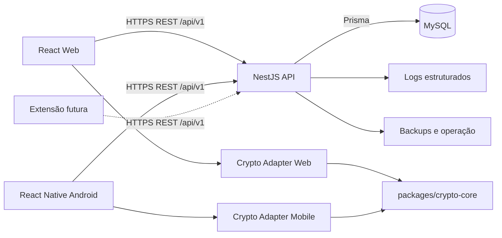
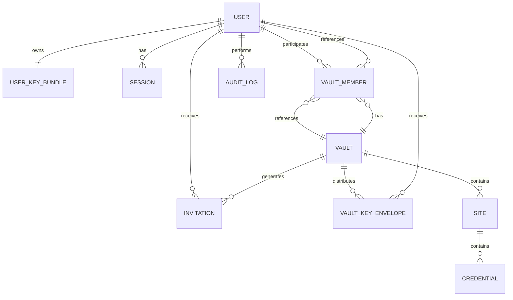
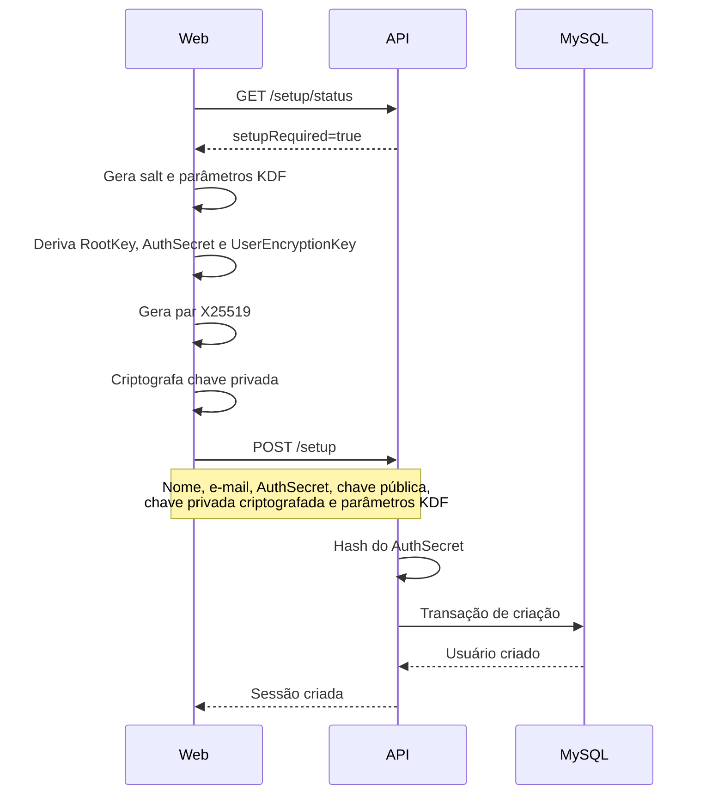
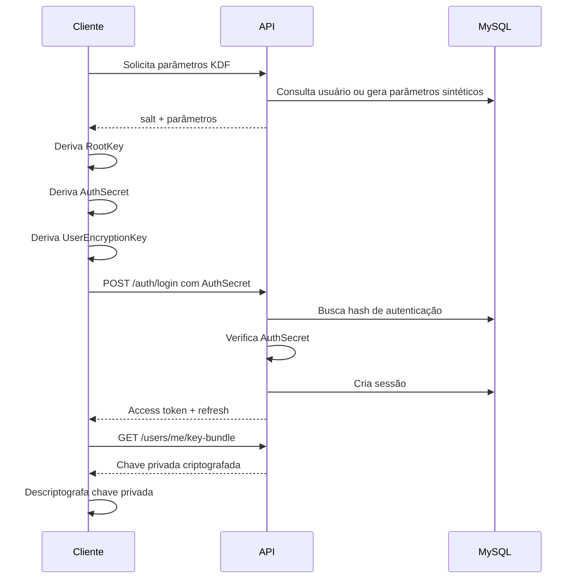
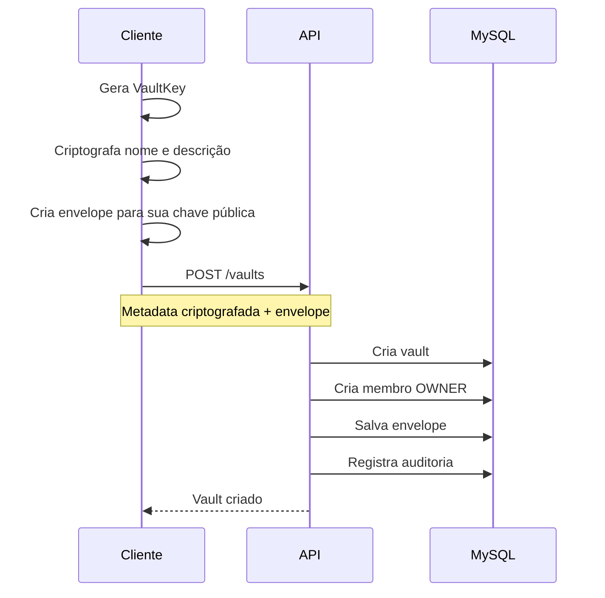
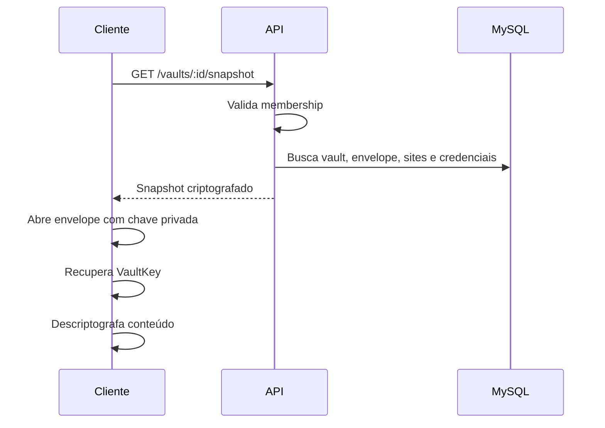
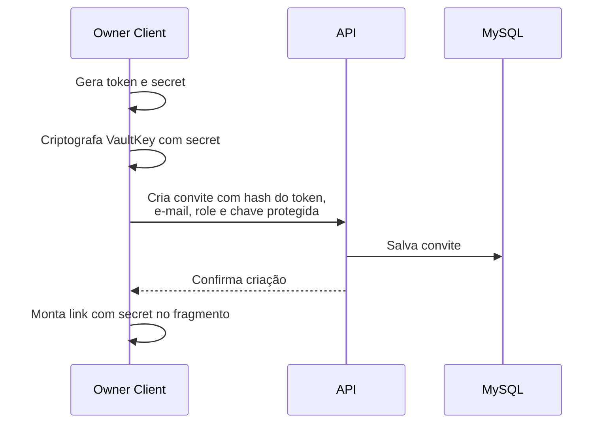
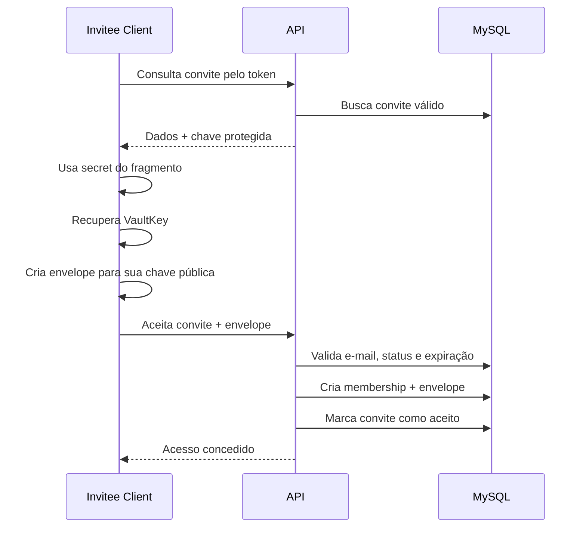
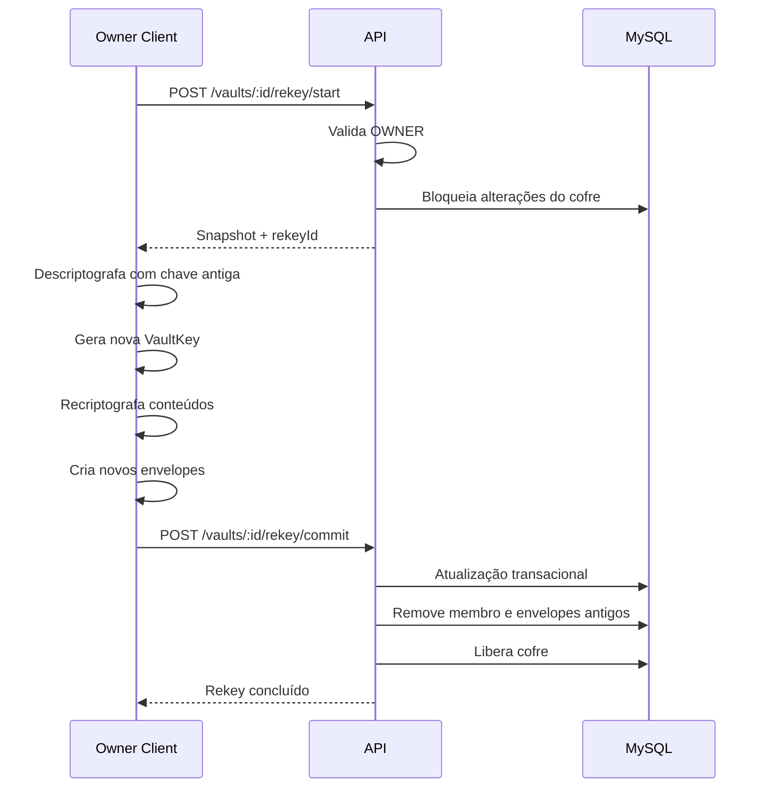
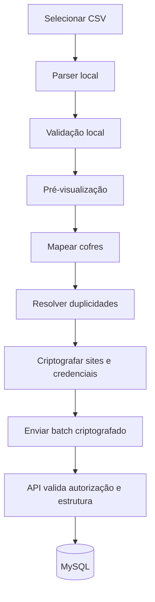

# ARCHITECTURE.md

# Crypta — Arquitetura do Sistema

> **Status:** Documento inicial para revisão  
> **Versão:** 0.2.0  
> **Última atualização:** 8 de agosto de 2026

---

## 1. Objetivo

Este documento define a arquitetura técnica do cofre de senhas descrito em `PROJECT_SCOPE.md`.

O sistema será:

- self-hosted;
- multiusuário;
- composto por aplicação Web, aplicativo Android, API e banco de dados;
- implantado em uma VPS por meio do Coolify;
- disponibilizado em repositório público;
- preparado para futura extensão de navegador e preenchimento automático no Android;
- baseado em criptografia no cliente para impedir que a API e o banco armazenem credenciais em texto aberto.

Este documento é a referência principal para decisões relacionadas a:

- divisão dos componentes;
- organização do repositório;
- autenticação;
- autorização;
- criptografia;
- compartilhamento de cofres;
- sincronização;
- importação CSV;
- implantação;
- testes;
- observabilidade;
- segurança operacional.

---

## 2. Escopo arquitetural

A arquitetura deverá suportar inicialmente:

```text
Usuário
└── Cofre privado ou compartilhado
    └── Site
        └── Uma ou mais credenciais
```

Cada site possui:

- nome;
- link opcional.

Cada credencial possui:

- usuário;
- senha;
- observação opcional.

A arquitetura não deverá criar abstrações prematuras para:

- chaves SSH;
- cartões;
- anexos;
- arquivos;
- TOTP;
- documentos;
- outros tipos de segredo.

---

## 3. Stack oficial

### 3.1 Monorepo e ferramentas

- Node.js;
- TypeScript;
- pnpm workspaces;
- Git;
- GitHub;
- ESLint;
- Prettier;
- Vitest/Jest conforme o projeto;
- GitHub Actions.

O uso de Turborepo poderá ser avaliado, mas não é obrigatório na primeira fase.

### 3.2 Aplicação Web

- React;
- Vite;
- TypeScript;
- React Router;
- TanStack Query;
- Zustand;
- Axios;
- React Hook Form;
- Zod;
- Tailwind CSS;
- shadcn/ui;
- Vitest;
- React Testing Library.

### 3.3 Backend

- Node.js;
- NestJS;
- TypeScript;
- Prisma ORM;
- MySQL;
- Swagger/OpenAPI;
- class-validator ou Zod, conforme a camada;
- Jest;
- Supertest.

### 3.4 Aplicativo Android

- React Native;
- Expo;
- TypeScript;
- Expo Development Build ou prebuild quando módulos nativos forem necessários;
- TanStack Query;
- Zustand;
- React Hook Form;
- Zod;
- armazenamento seguro apoiado pelo Android Keystore.

A primeira versão será distribuída por APK.

### 3.5 Banco de dados

- MySQL;
- mecanismo InnoDB;
- codificação `utf8mb4`;
- migrations controladas pelo Prisma;
- banco acessível somente pela rede interna do projeto no Coolify.

### 3.6 Criptografia

- Argon2id para derivação de chave;
- HKDF-SHA-256 para separação de contexto;
- XChaCha20-Poly1305 para criptografia autenticada;
- X25519 para compartilhamento de chaves;
- cada primitiva vem da origem que a implementa melhor, e não de uma biblioteca única (ADR 0017);
- na Web: Argon2id e XChaCha20-Poly1305 pelo `libsodium-wrappers-sumo` em WebAssembly, HKDF-SHA-256 e X25519 pelo `crypto.subtle`;
- gerador criptograficamente seguro fornecido pela plataforma.

A formulação anterior fixava "bibliotecas da família libsodium". Ela não sobreviveu à medição: nenhum build do `libsodium.js` expõe HKDF chamável, e o sealed box que corresponderia ao envelope declarado falha aberto. Os ADRs 0016 e 0017 registram as evidências.

### 3.7 Infraestrutura

- VPS Linux;
- GitHub Actions;
- GitHub Container Registry — GHCR;
- GitHub Environments;
- Coolify;
- três ambientes isolados: development, staging e production;
- Dockerfile individual por aplicação;
- proxy reverso gerenciado pelo Coolify;
- Nginx dentro da imagem do frontend Web para servir os arquivos estáticos;
- HTTPS obrigatório;
- publicação de Web e API como imagens versionadas;
- promoção do mesmo digest homologado para produção;
- backups externos ao repositório.

---

## 4. Princípios arquiteturais

### 4.1 Monólito modular

O backend será um monólito modular.

Não serão utilizados inicialmente:

- microserviços;
- filas;
- mensageria;
- Redis;
- service mesh;
- múltiplos bancos;
- event sourcing;
- CQRS completo.

A aplicação deverá permanecer simples sem perder separação interna de responsabilidades.

### 4.2 Frontends desacoplados

Web e Android serão clientes independentes da mesma API.

Nenhuma regra de negócio essencial poderá existir apenas na interface Web.

As regras deverão ficar:

- no backend, quando relacionadas a autorização, consistência ou persistência;
- em packages compartilhados, quando relacionadas a contratos, validação comum ou criptografia no cliente.

### 4.3 API sem confiança sobre o conteúdo

A API deverá ser tratada como um armazenador e coordenador de blobs criptografados.

Ela será responsável por:

- autenticação;
- sessões;
- autorização;
- associação entre usuários e cofres;
- persistência;
- convites;
- auditoria;
- controle de versão;
- consistência transacional.

Ela não deverá receber em texto aberto:

- nome do cofre;
- descrição do cofre;
- nome do site;
- link do site;
- usuário da credencial;
- senha;
- observação.

### 4.4 Segurança por padrão

Toda decisão deverá priorizar:

1. isolamento entre usuários;
2. confidencialidade;
3. integridade;
4. autorização;
5. simplicidade;
6. experiência de uso;
7. desempenho.

### 4.5 Contratos versionados

Contratos de API, payloads criptográficos e formatos de importação deverão possuir versão explícita.

Nenhuma mudança incompatível poderá ser introduzida silenciosamente.

---

## 5. Visão geral



---

## 6. Limites dos componentes

### 6.1 Web

Responsável por:

- interface;
- navegação;
- formulário;
- estado visual;
- derivação de chave;
- descriptografia;
- criptografia;
- busca local;
- leitura e validação do CSV;
- preparação de importação;
- gerenciamento temporário de chaves em memória.

Não responsável por:

- decidir autorização;
- acessar o banco;
- persistir segredos em texto aberto;
- confiar em permissões apenas por ocultação de botão.

### 6.2 Android

Responsável por:

- interface nativa;
- comunicação com a API;
- criptografia e descriptografia;
- proteção de tokens;
- integração futura com biometria;
- integração futura com Android Autofill.

Não responsável por:

- importação CSV na primeira versão;
- regras de autorização;
- persistência insegura de credenciais.

### 6.3 API

Responsável por:

- cadastro controlado;
- autenticação;
- sessões;
- autorização;
- membros;
- convites;
- envelopes de chave;
- persistência de dados criptografados;
- transações;
- auditoria;
- rate limit;
- versionamento;
- validação estrutural;
- Swagger.

Não responsável por:

- descriptografar cofres;
- descriptografar sites;
- descriptografar credenciais;
- analisar conteúdo de senha;
- fazer busca textual em conteúdo sensível;
- ler CSV com credenciais em texto aberto.

### 6.4 Banco

Responsável por armazenar:

- contas;
- hashes de autenticação;
- chaves públicas;
- chaves privadas criptografadas;
- sessões;
- estrutura de cofres;
- membros;
- envelopes de chave;
- convites;
- blobs criptografados;
- metadados técnicos;
- auditoria.

O banco não deverá conter valores sensíveis descriptografados.

---

## 7. Organização do monorepo

```text
/
├── apps/
│   ├── web/
│   ├── api/
│   └── mobile/
│
├── packages/
│   ├── contracts/
│   ├── crypto-core/
│   ├── crypto-web/
│   ├── crypto-mobile/
│   ├── validation/
│   ├── eslint-config/
│   └── tsconfig/
│
├── docs/
│   ├── PROJECT_SCOPE.md
│   ├── ARCHITECTURE.md
│   ├── DATABASE.md
│   ├── API.md
│   ├── SECURITY.md
│   ├── TELAS.md
│   ├── BACKLOG.md
│   ├── ROADMAP.md
│   └── decisions/
│
├── .github/
│   ├── release.yml
│   └── workflows/
│       ├── ci.yml
│       ├── validate-pr-flow.yml
│       ├── cleanup-temporary-branches.yml
│       ├── start-release.yml
│       ├── deploy-development.yml
│       ├── publish-prerelease.yml
│       └── publish-production.yml
│
├── .env.example
├── .gitignore
├── VERSION
├── CLAUDE.md
├── CONTRIBUTING.md
├── GITHUB_RELEASE_FLOW.md
├── config_user.md
├── README.md
├── package.json
├── pnpm-lock.yaml
└── pnpm-workspace.yaml
```

O arquivo `VERSION` contém somente `MAJOR.MINOR.PATCH`.

`GITHUB_RELEASE_FLOW.md` é a fonte de verdade do fluxo de branches, tags, RCs e releases.

`config_user.md` documenta as configurações manuais necessárias no GitHub, GHCR e Coolify.

## 8. Packages compartilhados

### 8.1 `packages/contracts`

Contém:

- tipos de request;
- tipos de response;
- enums;
- códigos de erro;
- modelos públicos da API;
- versões de payload;
- contratos de sincronização.

Não deverá conter:

- dependência do NestJS;
- dependência do React;
- lógica de banco;
- segredos;
- configuração de ambiente.

### 8.2 `packages/crypto-core`

Contém lógica independente de plataforma:

- definição dos formatos criptográficos;
- serialização;
- desserialização;
- composição de AAD;
- separação de domínio;
- interfaces dos adaptadores;
- validação de versão;
- tipos de chave;
- testes com vetores fixos.

Não deverá acessar diretamente:

- `window.crypto`;
- Android Keystore;
- filesystem;
- AsyncStorage;
- banco.

### 8.3 `packages/crypto-web`

Implementa para a Web:

- Argon2id;
- libsodium;
- geração aleatória;
- operações de chave;
- integração com o runtime do navegador.

### 8.4 `packages/crypto-mobile`

Implementa para Android:

- Argon2id;
- libsodium compatível com React Native;
- Android Keystore;
- geração aleatória;
- proteção local de tokens;
- futura proteção biométrica.

### 8.5 `packages/validation`

Contém schemas compartilháveis de:

- e-mail;
- URL;
- nomes;
- limites;
- CSV;
- formulários.

Validações de autorização continuam exclusivas do backend.

---

## 9. Estrutura da aplicação Web

```text
apps/web/src/
├── app/
│   ├── providers/
│   ├── router/
│   └── bootstrap/
├── components/
│   ├── ui/
│   ├── feedback/
│   ├── forms/
│   └── security/
├── features/
│   ├── auth/
│   ├── vaults/
│   ├── sites/
│   ├── credentials/
│   ├── invitations/
│   ├── import/
│   ├── sessions/
│   └── settings/
├── layouts/
├── lib/
├── services/
├── stores/
├── hooks/
├── styles/
└── main.tsx
```

### Regras

- organizar por feature;
- evitar pasta global de componentes sem domínio;
- chamadas HTTP em services;
- TanStack Query para estado remoto;
- Zustand somente para estado local/global necessário;
- dados descriptografados não persistidos em localStorage;
- access token mantido em memória;
- refresh token em cookie seguro;
- limpar stores no logout e no bloqueio.

---

## 10. Estrutura da API

```text
apps/api/src/
├── main.ts
├── app.module.ts
├── config/
├── common/
│   ├── decorators/
│   ├── filters/
│   ├── guards/
│   ├── interceptors/
│   ├── pipes/
│   ├── errors/
│   └── logging/
├── database/
│   └── prisma/
└── modules/
    ├── setup/
    ├── auth/
    ├── users/
    ├── user-keys/
    ├── sessions/
    ├── vaults/
    ├── memberships/
    ├── invitations/
    ├── sites/
    ├── credentials/
    ├── imports/
    ├── audit/
    └── health/
```

### Camadas por módulo

```text
module/
├── controllers/
├── services/
├── repositories/
├── dto/
├── policies/
├── mappers/
├── entities/
└── tests/
```

### Regras

- controller fino;
- service coordena casos de uso;
- repository concentra Prisma;
- policy valida autorização;
- mapper separa modelo interno de contrato público;
- DTO valida estrutura;
- nenhuma regra sensível somente no controller;
- nenhuma query Prisma fora dos repositories, salvo decisão registrada.

---

## 11. Estrutura do aplicativo Android

```text
apps/mobile/src/
├── app/
│   ├── navigation/
│   ├── providers/
│   └── bootstrap/
├── components/
├── features/
│   ├── auth/
│   ├── vaults/
│   ├── sites/
│   ├── credentials/
│   ├── invitations/
│   ├── sessions/
│   └── settings/
├── services/
├── stores/
├── hooks/
├── security/
└── theme/
```

### Regras

- dados descriptografados mantidos apenas em memória;
- refresh token no Android Keystore;
- nenhuma credencial em AsyncStorage;
- screenshots poderão ser bloqueados em telas sensíveis;
- logs nativos não poderão conter segredos;
- navegação deverá limpar telas sensíveis ao sair.

---

## 12. Modelo de dados conceitual



Entidades detalhadas serão documentadas em `DATABASE.md`.

---

## 13. Classificação dos dados

### 13.1 Dados não secretos

Podem ser processados pelo backend:

- ID do usuário;
- e-mail;
- nome de perfil;
- ID do cofre;
- ID do site;
- ID da credencial;
- papel do membro;
- status de convite;
- timestamps;
- versões;
- IP;
- user agent;
- eventos de auditoria;
- tamanho aproximado de blobs.

### 13.2 Dados criptografados no cliente

- nome do cofre;
- descrição;
- nome do site;
- link;
- usuário da credencial;
- senha;
- observação.

### 13.3 Dados que nunca podem ser enviados ao backend

- senha original do usuário;
- chave raiz;
- chave de criptografia do usuário;
- chave privada descriptografada;
- chave do cofre descriptografada;
- CSV em texto aberto;
- payload descriptografado.

### 13.4 Dados secretos do servidor

- chave de assinatura de tokens;
- segredo de cookies;
- credenciais do banco;
- chaves de serviços;
- chaves de backup;
- chave de assinatura do APK;
- segredos do Coolify.

---

## 14. Modelo criptográfico

### 14.1 Objetivo

O backend deverá conseguir autenticar e autorizar usuários sem possuir capacidade normal de descriptografar os dados armazenados.

### 14.2 Terminologia

- `UserPassword`: senha digitada pelo usuário.
- `RootKey`: chave raiz derivada da senha.
- `AuthSecret`: segredo derivado para autenticação.
- `UserEncryptionKey`: chave derivada para proteger a chave privada.
- `UserKeyPair`: par X25519 do usuário.
- `VaultKey`: chave simétrica aleatória de um cofre.
- `VaultKeyEnvelope`: cópia da VaultKey protegida para um membro.
- `CipherPayload`: dado criptografado e autenticado.
- `AAD`: dado autenticado não secreto.

### 14.3 Derivação

```text
UserPassword
    │
    ├── Argon2id + kdfSalt
    │       ↓
    │    RootKey
    │
    ├── HKDF(info="auth")
    │       ↓
    │    AuthSecret
    │
    └── HKDF(info="user-encryption")
            ↓
         UserEncryptionKey
```

A separação por contexto impede que o segredo usado para login seja igual à chave usada para criptografia.

### 14.4 Autenticação sem envio da senha original

O cliente enviará `AuthSecret` por HTTPS.

O backend armazenará apenas um verificador do `AuthSecret`, nunca o valor recebido.

Pelo [ADR 0022](decisions/0022-server-side-credentials.md) o verificador é `HMAC-SHA-256(pepper, authSecret)`, com o pepper derivado de `AUTH_SERVER_SECRET` e mantido fora do banco. Ele é rápido de propósito: o fator de trabalho contra a senha é o Argon2id da secao 14.3, executado no cliente, e repeti-lo aqui abriria a rota de login — que não é autenticada — à exaustão de memória.

O backend não receberá:

- `UserPassword`;
- `RootKey`;
- `UserEncryptionKey`.

O `AuthSecret` continua sendo uma credencial autenticadora e deverá:

- trafegar apenas por HTTPS;
- nunca ser logado;
- nunca ser persistido no cliente;
- ser tratado como secreto.

### 14.5 Par de chaves do usuário

No cadastro, o cliente gera:

- chave pública X25519;
- chave privada X25519.

A chave pública é enviada ao backend em texto aberto.

A chave privada é criptografada com `UserEncryptionKey` antes do envio.

O backend armazena:

- chave pública;
- chave privada criptografada;
- nonce;
- versão criptográfica;
- parâmetros KDF.

### 14.6 Chave do cofre

Cada cofre possui uma `VaultKey` aleatória de 256 bits.

A `VaultKey`:

- é criada no cliente;
- nunca é enviada em texto aberto;
- criptografa metadados, sites e credenciais;
- é distribuída aos membros por envelopes.

### 14.7 Envelope de chave

Para cada membro do cofre será criado um envelope contendo a `VaultKey` protegida para a chave pública daquele membro.

```text
VaultKey
    +
PublicKey do membro
    ↓
VaultKeyEnvelope
```

Somente a chave privada correspondente poderá recuperar a `VaultKey`.

A composição, fixada pelo [ADR 0023](decisions/0023-identity-aad-and-key-envelope.md), é a do RFC 9180: par X25519 efêmero por envelope, HKDF-SHA-256 sobre o segredo compartilhado mais as duas chaves públicas, e XChaCha20-Poly1305. Daí o nome `X25519-HKDF-SHA256-XCHACHA20-POLY1305`.

O nonce **é derivado junto com a chave da AEAD e não trafega**: como o par efêmero é novo a cada envelope, a chave da AEAD nunca se repete e o nonce derivado tampouco.

O enquadramento vive em `packages/crypto-core/src/format/key-envelope.ts`, que é o único lugar que conhece a fatia `ephemeralPublicKey || ciphertext` devolvida pelo adapter.

### 14.8 Criptografia dos conteúdos

Cada payload será criptografado com XChaCha20-Poly1305.

Exemplo conceitual:

```json
{
  "cryptoVersion": 1,
  "schemaVersion": 1,
  "algorithm": "XCHACHA20-POLY1305",
  "nonce": "base64url",
  "ciphertext": "base64url"
}
```

### 14.9 AAD

A AAD tem dois escopos, sob o prefixo de domínio `crypta-aad/v2` ([ADR 0023](decisions/0023-identity-aad-and-key-envelope.md)):

```text
escopo vault          escopo user
--------------        -----------------
scope                 scope
entityType            entityType
entityId              publicKey
vaultId               schemaVersion
schemaVersion         cryptoVersion
cryptoVersion
```

Isso dificulta a reutilização indevida de um ciphertext em outro contexto.

O escopo `user` protege a chave privada do usuário, que não pertence a cofre nenhum. Ele amarra à **chave pública do próprio par**, e não a um `userId`: além de o id ainda não existir quando o cliente cifra (secao 15), o vínculo com a chave pública detecta a troca de `publicKey` por um servidor malicioso, que de outro modo faria envelopes futuros serem endereçados à chave errada.

### 14.10 Versionamento criptográfico

Todo payload deverá possuir:

- `cryptoVersion`;
- `schemaVersion`;
- algoritmo;
- nonce;
- ciphertext.

`cryptoVersion: 1` identifica o conjunto completo: Argon2id, HKDF-SHA-256, XChaCha20-Poly1305, X25519, AAD `crypta-aad/v2` e envelope `X25519-HKDF-SHA256-XCHACHA20-POLY1305`. `schemaVersion` identifica a forma do objeto em texto claro, que existe apenas dentro do cliente.

Mudanças criptográficas deverão possuir migração explícita.

---

## 15. Cadastro do primeiro usuário



### Proteção do setup

O endpoint de setup deverá:

- funcionar somente quando não existir usuário;
- ser desativado após a criação;
- usar transação;
- rejeitar concorrência;
- possuir rate limit;
- registrar auditoria.

---

## 16. Login

### 16.1 Obtenção de parâmetros

Antes de derivar as chaves, o cliente consulta parâmetros KDF.

```text
GET /api/v1/auth/parameters?email=...
```

Para reduzir enumeração de contas, a API deverá retornar uma resposta estruturalmente válida mesmo para e-mails inexistentes.

### 16.2 Fluxo



### 16.3 Proteções

- rate limit por IP;
- rate limit por conta;
- resposta genérica;
- atraso controlado;
- hash forte;
- nenhum log do segredo;
- bloqueio temporário progressivo;
- auditoria sem dados sensíveis.

---

## 17. Sessões e tokens

Prazos e atributos estão fixados pelo [ADR 0021](decisions/0021-session-token-lifetimes.md); algoritmo de assinatura, armazenamento em repouso e bloqueio, pelo [ADR 0022](decisions/0022-server-side-credentials.md).

### 17.1 Access token

- 15 minutos, configurável entre `1m` e `60m`;
- JWT assinado em `EdDSA` sobre Ed25519, pela `jose`, com o algoritmo esperado declarado na verificação;
- claims exatamente `iss`, `aud`, `sub`, `sid`, `iat` e `exp`;
- enviado em `Authorization: Bearer`;
- mantido somente em memória;
- não armazenado em localStorage;
- carrega o identificador da sessão (`sid`), verificado a cada requisição — a revogação é imediata e não espera a expiração.

### 17.2 Refresh token

- aleatório e opaco, 32 bytes de CSPRNG em base64url;
- 7 dias de inatividade e 30 dias absolutos, os dois limites simultâneos;
- `SHA-256` armazenado no banco, com índice único, e busca pelo hash;
- rotacionado a cada uso, com janela de tolerância de 10 segundos para rotação concorrente;
- revogável;
- associado a sessão e dispositivo.

### 17.3 Web

- refresh token em cookie `HttpOnly`;
- `Secure`;
- `Path=/api/v1/auth`;
- `SameSite=Strict` por padrão, configurável;
- sem atributo `Domain` — host-only, sem compartilhamento entre ambientes;
- cookie duplicado na mesma requisição é rejeitado;
- validação de origem;
- access token em memória.

### 17.4 Android

- refresh token protegido pelo Android Keystore;
- access token em memória;
- remoção completa no logout;
- suporte futuro a desbloqueio biométrico.

### 17.5 Reutilização de refresh token

Se um refresh token já rotacionado for reutilizado:

- revogar a sessão;
- opcionalmente revogar a família;
- registrar evento;
- exigir novo login.

### 17.6 Bloqueio de login

- contador de falhas consecutivas e instante de liberação na linha do usuário, no MySQL — não em memória, que sumiria a cada deploy;
- espera inicial de 60 s após 5 falhas, dobrando a cada nova falha até o teto de 900 s, zerada no sucesso;
- nunca permanente;
- filtro por IP em memória do processo como camada anterior, 60 requisições por minuto sobre as rotas de autenticação;
- o estado da conta só é revelado a quem já apresentou o `AuthSecret` correto — antes disso a resposta é sempre `INVALID_CREDENTIALS`, para não virar oráculo de enumeração.

---

## 18. Autorização

### 18.1 Regra central

Toda operação deverá validar no backend:

```text
usuário autenticado
+
membro ativo
+
papel
+
recurso pertencente ao cofre
+
ação permitida
```

### 18.2 Papéis iniciais

#### OWNER

Pode:

- editar cofre;
- excluir cofre;
- gerenciar membros;
- criar e cancelar convites;
- criar, editar e excluir sites;
- criar, editar e excluir credenciais;
- importar.

#### EDITOR

Pode:

- visualizar;
- criar, editar e excluir sites;
- criar, editar e excluir credenciais;
- importar em cofre compartilhado;
- sair do cofre.

Não pode:

- excluir o cofre;
- gerenciar membros;
- alterar permissões;
- transferir propriedade.

### 18.3 Prevenção de IDOR

Nenhum endpoint deverá consultar um recurso apenas pelo ID e retorná-lo.

A consulta deverá incluir o contexto autorizado.

Exemplo conceitual:

```text
credential.id = requestedId
AND site.vault.members includes currentUser
AND membership.status = ACTIVE
```

---

## 19. Criação de cofre



A API deverá usar uma única transação.

---

## 20. Leitura de cofre



### Snapshot

O snapshot poderá conter:

- metadados criptografados do cofre;
- envelope do usuário;
- sites;
- credenciais;
- versões;
- membros não sensíveis;
- cursor de sincronização.

---

## 21. Sites e credenciais

### 21.1 Payload do site

Exemplo descriptografado apenas no cliente:

```json
{
  "schemaVersion": 1,
  "name": "Google",
  "link": "https://accounts.google.com"
}
```

### 21.2 Payload da credencial

Exemplo descriptografado apenas no cliente:

```json
{
  "schemaVersion": 1,
  "username": "usuario@example.com",
  "password": "senha-secreta",
  "notes": "Conta principal"
}
```

### 21.3 Persistência

O banco armazenará:

```text
id
vaultId
siteId, quando aplicável
encryptedPayload
cryptoVersion
schemaVersion
version
createdBy
updatedBy
createdAt
updatedAt
```

---

## 22. Busca

### 22.1 Estratégia inicial

A busca será realizada no cliente.

Fluxo:

```text
cliente recebe snapshot criptografado
→ descriptografa em memória
→ indexa localmente
→ busca por nome do site e usuário
```

### 22.2 Razão

A API não possui o texto necessário para pesquisa.

### 22.3 Limitações aceitas

- o cofre precisa estar desbloqueado;
- o conteúdo precisa estar carregado;
- a busca global poderá exigir carregar os cofres acessíveis;
- não haverá indexação de observações na primeira versão.

### 22.4 Persistência do índice

O índice descriptografado não deverá ser persistido em:

- localStorage;
- IndexedDB;
- AsyncStorage;
- arquivo local.

---

## 23. Compartilhamento

### 23.1 Requisitos

O compartilhamento deverá:

- funcionar para usuário existente;
- funcionar por link para novo usuário;
- não revelar a `VaultKey` ao backend;
- exigir aceite;
- possuir expiração;
- ser revogável antes do aceite;
- validar o e-mail convidado;
- gerar auditoria.

### 23.2 Convite protegido por segredo

O cliente do proprietário gera:

- `inviteToken`;
- `inviteSecret`.

O `inviteToken` identifica o convite.

O `inviteSecret` protege temporariamente a `VaultKey`.

```text
VaultKey
+
inviteSecret
↓
EncryptedVaultKeyForInvite
```

### 23.3 URL

Formato conceitual:

```text
https://app.exemplo.com/invite/{token}#secret={secret}
```

O fragmento após `#` não é enviado automaticamente ao servidor pelo navegador.

A interface deverá evitar registrar essa URL.

### 23.4 Criação



### 23.5 Aceite



### 23.6 Cadastro durante o convite

Se o convidado não possuir conta:

```text
abre link
→ cria conta
→ autentica
→ retorna ao convite
→ recupera VaultKey
→ cria envelope
→ aceita
```

### 23.7 Limitações

- quem tiver link completo e conta com o e-mail autorizado poderá tentar aceitar;
- o link deverá ser enviado por canal confiável;
- convite será de uso único;
- o segredo não deverá aparecer em logs;
- o segredo deverá ser removido da URL após leitura;
- o segredo não deverá ser persistido.

---

## 24. Remoção de membro e rotação de chave

### 24.1 Revogação de acesso

Remover membership impede novas consultas pela API.

Isso não apaga informações já visualizadas ou copiadas pelo membro.

### 24.2 Rotação obrigatória

Após remover um membro, o proprietário deverá gerar nova `VaultKey`.

Todos os conteúdos deverão ser recriptografados com a nova chave.

Novos envelopes deverão ser criados somente para membros restantes.

### 24.3 Fluxo de rekey



### 24.4 Falha

Se houver falha:

- nenhuma alteração parcial será confirmada;
- o cofre permanecerá com a chave anterior;
- o membro poderá permanecer bloqueado pela autorização;
- o processo poderá ser retomado ou cancelado.

### 24.5 Limitação inevitável

Nenhuma arquitetura consegue apagar:

- senha copiada;
- screenshot;
- exportação manual;
- informação anteriormente memorizada.

A rotação protege dados futuros e cópias futuras do banco.

---

## 25. Alteração de senha da conta

A alteração de senha não exige recriptografar todos os cofres.

Fluxo:

```text
senha atual
→ deriva chaves atuais
→ descriptografa chave privada
→ gera novo salt
→ deriva novas chaves
→ recriptografa chave privada
→ envia novo AuthSecret e novo bundle
```

A API deverá atualizar em uma transação:

- hash de autenticação;
- parâmetros KDF;
- chave privada criptografada;
- versão do bundle;
- sessões, conforme política.

Após alteração:

- revogar outras sessões;
- manter ou revogar sessão atual por decisão explícita;
- exigir novo desbloqueio.

---

## 26. Recuperação de conta

### 26.1 Primeira versão

Não haverá recuperação que preserve automaticamente os dados sem a senha correta.

### 26.2 Motivo

A API não possui a chave necessária para abrir a chave privada.

### 26.3 Opções futuras

- chave de recuperação;
- contato de emergência;
- recuperação social;
- passkey;
- dispositivo confiável;
- kit de recuperação.

### 26.4 Redefinição destrutiva

Poderá existir futuramente um fluxo de redefinição que:

- cria novo material criptográfico;
- remove acesso aos cofres privados antigos;
- permite que proprietários de cofres compartilhados convidem o usuário novamente.

Esse fluxo deverá possuir avisos explícitos.

---

## 27. Importação CSV

### 27.1 Regra principal

O CSV será processado no navegador.

O arquivo em texto aberto não será enviado à API.

### 27.2 Fluxo



### 27.3 Parser

Deverá:

- operar em memória;
- usar UTF-8;
- respeitar aspas;
- tratar delimitador;
- limitar tamanho;
- limitar linhas;
- não registrar conteúdo;
- limpar referências após conclusão.

### 27.4 Duplicidades

Como a API não conhece o conteúdo, a comparação será feita no cliente após descriptografar o cofre.

Chave conceitual:

```text
cofre + nome normalizado do site + usuário normalizado
```

### 27.5 Batch

O envio deverá conter:

- `importId` idempotente;
- entidades criptografadas;
- IDs;
- relações;
- versões;
- resultado esperado;
- sem conteúdo em texto aberto.

### 27.6 Transação

A API deverá:

- validar limite;
- validar autorização por cofre;
- validar referências;
- aplicar transação por lote ou por cofre;
- impedir duplicação por reenvio do mesmo `importId`;
- registrar resumo de auditoria.

### 27.7 Falha parcial

Preferência inicial:

- transação independente por cofre;
- relatório por cofre;
- nenhuma linha parcialmente gravada dentro da mesma transação.

---

## 28. Controle de concorrência

### 28.1 Problema

Dois usuários podem editar a mesma credencial.

### 28.2 Estratégia

Cada entidade mutável possuirá `version`.

O cliente envia:

```text
expectedVersion
```

A API atualiza somente quando:

```text
currentVersion == expectedVersion
```

### 28.3 Conflito

Em caso de diferença:

- responder `409 CONFLICT`;
- retornar versão atual criptografada;
- não sobrescrever silenciosamente;
- permitir recarregar ou revisar.

### 28.4 Exclusão

Exclusão também deverá validar versão quando aplicável.

---

## 29. Sincronização

### 29.1 Primeira versão

O sistema será online-first.

Não haverá edição offline.

### 29.2 Snapshot por cofre

O cliente poderá solicitar:

```text
GET /vaults/:id/snapshot
```

### 29.3 Sincronização incremental

Poderá ser suportada por:

```text
GET /vaults/:id/changes?cursor=...
```

Os eventos retornam:

- entidade;
- ID;
- operação;
- versão;
- payload criptografado;
- cursor.

### 29.4 Polling

Inicialmente:

- atualização ao entrar na tela;
- atualização após mutação;
- refetch ao voltar para foreground;
- polling leve opcional.

WebSocket não é necessário na primeira versão.

---

## 30. Cache e armazenamento local

### 30.1 Web

Permitido:

- cache em memória;
- query cache em memória;
- refresh cookie seguro.

Não permitido:

- payload descriptografado em localStorage;
- senha em sessionStorage;
- chave privada aberta persistida;
- VaultKey persistida.

### 30.2 Android

Permitido:

- refresh token no Keystore;
- preferências não sensíveis;
- cache criptografado futuro.

Não permitido:

- senha em AsyncStorage;
- VaultKey em texto aberto;
- credencial em logs;
- banco local descriptografado.

### 30.3 Limpeza

No logout:

- limpar cache;
- limpar chaves em memória;
- limpar access token;
- remover refresh token;
- invalidar queries;
- fechar telas sensíveis.

---

## 31. API

### 31.1 Estilo

REST JSON.

Prefixo:

```text
/api/v1
```

### 31.2 Recursos principais

```text
/setup
/auth
/users
/sessions
/vaults
/memberships
/invitations
/sites
/credentials
/imports
/audit
/health
```

### 31.3 Envelope de sucesso

```json
{
  "data": {},
  "meta": {}
}
```

### 31.4 Envelope de erro

```json
{
  "error": {
    "code": "VAULT_ACCESS_DENIED",
    "message": "Você não possui permissão para esta ação.",
    "requestId": "uuid",
    "details": []
  }
}
```

### 31.5 Regras

- não retornar stack trace;
- não retornar segredo;
- mensagens públicas controladas;
- códigos estáveis;
- request ID;
- paginação quando aplicável;
- idempotência em operações críticas.

---

## 32. Banco de dados

### 32.1 Configuração

- MySQL 8;
- InnoDB;
- `utf8mb4`;
- timezone UTC;
- timestamps em UTC;
- migrations Prisma;
- usuário de aplicação com privilégio mínimo.

### 32.2 Acesso

O banco:

- não terá porta publicada;
- aceitará conexão somente do backend;
- terá senha definida no Coolify;
- não será acessado diretamente pelos clientes;
- terá backups protegidos.

### 32.3 IDs

Preferência:

- UUID ou UUIDv7;
- nunca IDs sequenciais expostos como medida de segurança;
- autorização continua obrigatória.

### 32.4 Exclusões

A decisão entre hard delete e soft delete será documentada por entidade em `DATABASE.md`.

Segredos excluídos não deverão permanecer acessíveis pela aplicação.

---

## 33. Auditoria

### 33.1 Eventos

Registrar:

- login;
- falha de login;
- logout;
- refresh suspeito;
- revogação;
- criação e exclusão de cofre;
- alterações de membership;
- convites;
- CRUD de site;
- CRUD de credencial;
- importação;
- rekey;
- alteração de senha.

### 33.2 Conteúdo permitido

- action;
- actorId;
- vaultId;
- entityId;
- timestamp;
- requestId;
- IP;
- user agent;
- resultado;
- metadados técnicos mínimos.

### 33.3 Conteúdo proibido

- senha;
- usuário da credencial;
- observação;
- link;
- nome descriptografado;
- token;
- cookie;
- ciphertext completo;
- chave;
- segredo de convite.

---

## 34. Observabilidade

### 34.1 Logs

- JSON estruturado;
- request ID;
- nível;
- timestamp;
- módulo;
- duração;
- código HTTP;
- sem dados sensíveis.

### 34.2 Health checks

```text
GET /health/live
GET /health/ready
```

`live` verifica processo.

`ready` verifica:

- banco;
- migrations;
- dependências essenciais.

### 34.3 Métricas

Inicialmente:

- latência;
- taxa de erros;
- quantidade de logins bloqueados;
- conexões de banco;
- uso de memória;
- reinicializações;
- falhas de importação.

### 34.4 Versão implantada

A API deverá expor:

```text
GET /api/v1/version
```

Exemplo:

```json
{
  "version": "0.4.0-rc.2",
  "commit": "b85c091",
  "environment": "staging",
  "builtAt": "2026-07-31T17:00:00Z"
}
```

Esses valores serão injetados no build:

```text
APP_VERSION
APP_COMMIT
APP_ENVIRONMENT
APP_BUILT_AT
```

A Web poderá exibir os mesmos metadados em uma área de diagnóstico.

### 34.5 Alertas

Futuros:

- indisponibilidade;
- falha de backup;
- crescimento de erros;
- uso elevado;
- tentativas suspeitas;
- deployment com versão inesperada;
- divergência entre tag e digest;
- falha de publicação no GHCR.

---

## 35. Segurança HTTP

O backend deverá usar:

- HTTPS;
- Helmet;
- HSTS;
- CSP adequada;
- `X-Content-Type-Options`;
- `Referrer-Policy`;
- política de frames;
- CORS restrito;
- body limit;
- rate limit;
- validação de origem;
- cookies seguros;
- proteção contra CSRF em endpoints baseados em cookie.

O frontend não deverá usar scripts de terceiros sem revisão.

---

## 36. Topologia de deploy no Coolify

### 36.1 Ambientes

```text
crypta-development
├── web
├── api
└── mysql-development

crypta-staging
├── web
├── api
└── mysql-staging

crypta-production
├── web
├── api
└── mysql-production
```

Os ambientes não compartilham:

- banco;
- volume;
- credenciais;
- cookie domain;
- secrets;
- URLs;
- backups operacionais.

### 36.2 Mapeamento GitHub

| Estado          | Branch/tag           | GitHub Environment | Coolify              |
| --------------- | -------------------- | ------------------ | -------------------- |
| Desenvolvimento | `develop`, `dev-*`   | `development`      | `crypta-development` |
| Homologação     | `staging`, `v*-rc.*` | `staging`          | `crypta-staging`     |
| Produção        | `main`, `v*` estável | `production`       | `crypta-production`  |

### 36.3 Web e API

Cada ambiente executa imagens de:

```text
ghcr.io/<owner>/<repository>-web
ghcr.io/<owner>/<repository>-api
```

A Web continua sendo servida pelo Nginx.

A API continua utilizando imagem Node mínima e usuário não-root.

### 36.4 Banco

Cada projeto possui um recurso MySQL:

- volume persistente próprio;
- rede privada;
- usuário próprio;
- backup compatível com o ambiente;
- sem exposição pública.

### 36.5 Domínios sugeridos

Development:

```text
crypta-dev.example.com
api-crypta-dev.example.com
```

Staging:

```text
crypta-staging.example.com
api-crypta-staging.example.com
```

Production:

```text
crypta.example.com
api-crypta.example.com
```

### 36.6 Variables e secrets

Configuração manual no GitHub e Coolify deve seguir `config_user.md`.

Nenhum segredo será versionado.

Secrets de produção não poderão ser reutilizados em ambientes inferiores.

---

## 37. Dockerfiles e imagens

### 37.1 Regras gerais

- multi-stage;
- imagens base fixadas de forma controlada;
- usuário não-root;
- dependências de produção apenas;
- cache eficiente;
- `.dockerignore`;
- sem `.env`;
- sem source maps públicos sensíveis;
- health check quando apropriado;
- metadados de versão no build.

### 37.2 Contexto do monorepo

O build utilizará a raiz do repositório como contexto.

Dockerfiles:

```text
apps/web/Dockerfile
apps/api/Dockerfile
```

O Dockerfile deverá copiar apenas arquivos necessários ao workspace correspondente.

### 37.3 Tags

Development:

```text
development
dev-<commit-sha>
```

Release candidate:

```text
vX.Y.Z-rc.N
staging
```

Produção:

```text
vX.Y.Z
production
```

As tags móveis indicam o último deployment.

RCs, tags estáveis e digests são imutáveis.

---

## 38. Deploy antecipado em development

O primeiro deploy ocorrerá no Environment `development` quando existirem:

- `ci.yml`;
- Dockerfile da Web;
- Dockerfile da API;
- uma rota de health;
- uma rota de versão;
- uma primeira tela;
- conexão com `mysql-development`;
- consumo real da API pela Web.

Primeira integração:

```text
Web: tela de status
→ API: GET /api/v1/health/ready
→ MySQL: verificação de conexão
```

Identificação:

```text
Web/API
→ GET /api/v1/version
→ version + commit + environment + builtAt
```

O objetivo é validar cedo:

- build context;
- GHCR;
- Coolify;
- webhooks ou API;
- CORS;
- cookies;
- proxy;
- DNS;
- SSL;
- rede;
- migrations;
- variables;
- secrets.

---

## 39. CI/CD e fluxo de releases

### 39.1 Branches permanentes

```text
develop
staging
main
```

### 39.2 Fluxos permitidos

```text
feature/*  → develop
bugfix/*   → develop
chore/*    → develop
refactor/* → develop
docs/*     → develop
security/* → develop

fix/*      → release/*
release/*  → staging
staging    → main
main       → develop

hotfix/*   → main
main       → release/*   quando houver release ativa
```

O workflow `validate-pr-flow.yml` deverá impedir combinações diferentes.

### 39.3 CI comum

Todo PR deverá executar:

- instalação imutável;
- format check;
- lint;
- typecheck;
- testes unitários;
- testes de integração;
- testes dos packages;
- build Web;
- build API;
- dependency audit;
- secret scan;
- validações específicas do fluxo.

### 39.4 Desenvolvimento

Push em `develop`:

1. executa CI;
2. constrói Web e API;
3. publica `dev-<sha>`;
4. atualiza a tag móvel `development`;
5. implanta em `development`.

### 39.5 Início de release

O workflow manual:

```text
start-release.yml
```

deverá:

1. validar `MAJOR.MINOR.PATCH`;
2. criar `release/x.y.z` a partir de `develop`;
3. atualizar `VERSION`;
4. abrir `release/x.y.z → staging`.

A release fica congelada para novas funcionalidades.

### 39.6 Release candidate

Merge de `release/* → staging`:

1. calcula `vX.Y.Z-rc.N`;
2. cria tag imutável;
3. constrói Web e API uma única vez;
4. publica imagens no GHCR;
5. captura os digests;
6. gera `release-manifest.json`;
7. cria GitHub Pre-release;
8. implanta os digests no Environment `staging`.

Nova correção:

```text
release/x.y.z
→ fix/*
→ release/x.y.z
→ staging
→ próxima RC
```

Não corrigir diretamente em `staging`.

### 39.7 Produção

Merge de `staging → main`:

1. lê `VERSION`;
2. identifica a RC aprovada;
3. recupera `release-manifest.json`;
4. promove os mesmos digests;
5. cria tag `vX.Y.Z`;
6. cria GitHub Release;
7. implanta em `production`;
8. abre sincronização `main → develop`.

Não existe novo build em uma release normal.

### 39.8 Hotfix

Hotfix:

```text
main
→ hotfix/*
→ main
→ nova versão PATCH
```

Depois:

```text
main → develop
```

Se houver release ativa:

```text
main → release/x.y.z
```

O código do hotfix entra na release, mas o arquivo `VERSION` mantém a versão futura.

### 39.9 Migrations

Migrations devem:

- ser testadas em development;
- ser executadas em staging antes da aprovação;
- utilizar `prisma migrate deploy`;
- possuir backup e rollback para mudança destrutiva;
- ser executadas antes do tráfego da versão dependente.

O comando roda no entrypoint do container da API, antes de o processo aceitar tráfego (ADR 0015). O Coolify implanta uma imagem pronta e recebe apenas o sinal de deploy: não existe etapa intermediária onde o comando pudesse rodar, e o banco fica em rede privada, fora do alcance do runner da GitHub Actions.

Falha de migration derruba o container antes da aplicação subir, e o orquestrador mantém a versão anterior no ar.

Rollback de imagem não desfaz migration aplicada: voltar para um artefato anterior devolve o código, não o schema. A compatibilidade temporária descrita em 46.1 é a proteção nesse caso.

### 39.10 Rollback

Rollback usa:

- tag estável anterior; ou
- digest anterior registrado.

Tags não podem ser movidas.

Uma versão defeituosa não é republicada com a mesma tag.

---

## 40. Repositório público e governança

### 40.1 Arquivos obrigatórios

- `.gitignore`;
- `.env.example`;
- `VERSION`;
- `SECURITY.md`;
- `CONTRIBUTING.md`;
- `GITHUB_RELEASE_FLOW.md`;
- `config_user.md`;
- `.github/release.yml`;
- workflows;
- licença;
- divulgação responsável.

### 40.2 Proteções

- `develop` como branch padrão;
- rulesets para `develop`, `staging`, `main` e `release/*`;
- tags `v*` protegidas;
- PR obrigatório;
- checks obrigatórios;
- force push bloqueado;
- exclusão restrita;
- permissões mínimas das Actions;
- secret scanning;
- Dependabot.

### 40.3 Proibido versionar

- `.env`;
- chaves;
- certificados;
- credenciais;
- tokens;
- banco;
- dumps;
- backups;
- APK signing key;
- dados reais;
- CSV real;
- logs;
- secrets do Coolify ou GHCR.

### 40.4 Histórico Git

Segredo commitado deverá ser:

1. revogado;
2. substituído;
3. removido do histórico quando aplicável;
4. tratado como comprometido.

Tags e releases publicadas são tratadas como imutáveis.

## 41. Testes

### 41.1 Pirâmide

```text
             E2E
       Integração/API
   Componentes e serviços
        Unitários
```

### 41.2 Crypto

Obrigatório:

- vetores determinísticos;
- criptografia/descriptografia;
- falha com ciphertext alterado;
- falha com AAD incorreta;
- separação de domínio;
- envelopes;
- rotação;
- compatibilidade Web/Android;
- migração de versões.

### 41.3 Backend

- autenticação;
- refresh rotation;
- sessão revogada;
- IDOR;
- OWNER;
- EDITOR;
- convite;
- expiração;
- aceite;
- import batch;
- version conflict;
- rekey;
- transações.

### 41.4 Web

- formulários;
- permissões visuais;
- desbloqueio;
- busca local;
- importação;
- limpeza no logout;
- senha mascarada;
- estados de erro.

### 41.5 Android

- login;
- Keystore;
- navegação;
- bloqueio de screenshot, quando adotado;
- limpeza de sessão;
- cópia;
- compatibilidade criptográfica.

### 41.6 E2E

Fluxos mínimos:

1. criar primeiro usuário;
2. criar cofre;
3. criar site;
4. criar credencial;
5. logout e login;
6. ler credencial;
7. convidar segundo usuário;
8. aceitar;
9. editar compartilhado;
10. remover membro e rotacionar;
11. importar CSV;
12. revogar sessão.

---

## 42. Documentação da API

Swagger deverá documentar:

- endpoints;
- autenticação;
- parâmetros;
- status;
- erros;
- exemplos sem dados reais;
- contratos criptografados;
- limites;
- idempotência.

Swagger não deverá revelar:

- segredos;
- valores reais;
- regras internas exploráveis desnecessariamente;
- stack traces.

---

## 43. Performance

### 43.1 Premissas

Uso inicial:

- poucos usuários;
- poucos cofres;
- centenas ou poucos milhares de credenciais;
- VPS única.

### 43.2 Prioridades

- segurança antes de micro-otimização;
- snapshots compactos;
- compressão HTTP avaliada;
- índices de banco;
- queries limitadas;
- operações em lote;
- KDF calibrado.

### 43.3 KDF

Os parâmetros Argon2id deverão ser medidos em:

- navegador desktop;
- Android mais fraco suportado;
- Android médio.

A meta deverá equilibrar:

- resistência;
- login aceitável;
- consumo de memória;
- estabilidade.

Os parâmetros ficarão salvos por usuário para futura atualização.

---

## 44. Limites operacionais iniciais

Valores exatos serão definidos em configuração, mas deverão existir limites para:

- tamanho de request;
- tamanho do payload criptografado;
- quantidade de cofres;
- quantidade de sites por cofre;
- quantidade de credenciais por site;
- tamanho de observação;
- tamanho de CSV;
- linhas por importação;
- convites pendentes;
- tentativas de login;
- sessões por usuário.

Os limites deverão ser:

- documentados;
- validados no cliente;
- validados novamente na API;
- configuráveis por ambiente.

---

## 45. Backups

### 45.1 Banco

- backup automatizado;
- criptografado;
- armazenado fora da VPS quando possível;
- retenção definida;
- teste de restauração.

### 45.2 Chaves

Backups do banco armazenam somente dados criptografados.

Secrets do servidor deverão possuir backup separado e seguro.

### 45.3 Restauração

O procedimento deverá validar:

- banco;
- migrations;
- integridade;
- usuários;
- envelopes;
- leitura por cliente;
- auditoria.

### 45.4 Limitação

Sem senha e chave privada válida, o backup do banco não permite recuperar conteúdo.

Isso é comportamento esperado.

---

## 46. Atualizações e migrations

### 46.1 Banco

- migrations Prisma revisadas;
- backup antes de migration destrutiva;
- compatibilidade temporária quando necessário;
- rollback documentado quando possível.

### 46.2 Payload criptografado

Mudanças de schema deverão:

- incrementar `schemaVersion`;
- manter leitor da versão anterior;
- migrar no cliente;
- recriptografar;
- atualizar de forma controlada.

### 46.3 Crypto

Mudança de algoritmo deverá:

- criar nova `cryptoVersion`;
- manter suporte de leitura temporário;
- recriptografar;
- nunca substituir ciphertext sem validação.

---

## 47. Ameaças consideradas

A arquitetura deverá reduzir risco de:

- vazamento do banco;
- acesso indevido por ID;
- membro sem permissão;
- roubo de refresh token;
- reutilização de token;
- brute force;
- alteração de ciphertext;
- vazamento de log;
- CSV malformado;
- convite interceptado;
- remoção incompleta de membro;
- supply chain;
- workflow comprometido;
- secret de Environment vazado;
- imagem do GHCR adulterada;
- promoção de branch inválida;
- divergência entre artefato homologado e produzido;
- tag movida;
- segredo commitado;
- banco exposto;
- backup vazado.

Análise completa será documentada em `SECURITY.md`.

---

## 48. Limitações do modelo

### 48.1 Frontend Web comprometido

Um servidor comprometido poderá entregar JavaScript malicioso e capturar dados durante o uso.

Mitigações:

- CSP;
- dependências revisadas;
- build reproduzível quando possível;
- subresource controls;
- monitoramento;
- extensão futura com binário separado;
- aplicativo Android assinado.

### 48.2 Dispositivo comprometido

Malware, root, keylogger ou captura de tela podem expor credenciais.

### 48.3 Membro autorizado

Um membro pode copiar dados aos quais possui acesso.

### 48.4 Metadados

A API conhece:

- contas;
- IDs;
- relação de membership;
- frequência de uso;
- IP;
- horários;
- tamanho aproximado.

### 48.5 Recuperação

Senha perdida poderá significar perda de acesso aos dados.

---

## 49. Decisões explicitamente rejeitadas

### 49.1 Criptografia somente no backend

Rejeitada porque:

- o servidor teria acesso aos segredos;
- vazamento de aplicação ou chave mestre exporia todos os dados;
- não atende ao objetivo de proteção.

### 49.2 Credenciais em colunas plaintext

Rejeitada.

### 49.3 Banco acessível diretamente pelo frontend

Rejeitada.

### 49.4 JWT permanente

Rejeitado.

### 49.5 Refresh token em localStorage

Rejeitado.

### 49.6 CSV enviado em texto aberto à API

Rejeitado.

### 49.7 Pesquisa server-side em conteúdo sensível

Rejeitada na primeira versão.

### 49.8 Microserviços

Rejeitados por complexidade desnecessária.

### 49.9 Docker Compose no deploy

Não será utilizado, conforme estratégia do Coolify.

### 49.10 Reconstruir produção após homologação

Rejeitado.

Uma release normal deverá promover os mesmos digests homologados.

### 49.11 Corrigir diretamente em `staging`

Rejeitado.

Correções de homologação devem entrar em `fix/* → release/*`.

### 49.12 Deploy de feature direto em produção

Rejeitado.

Produção recebe `staging` ou `hotfix/*` conforme o fluxo autorizado.

---

## 50. Decisões pendentes

As decisões abaixo deverão ser fechadas antes da implementação correspondente:

- biblioteca exata de libsodium para React Native;
- limite do CSV;
- limite de payload;
- expiração de convite;
- estratégia de envio de convite;
- bloqueio de screenshot no Android;
- suporte inicial à sincronização incremental;
- estratégia de rekey para grandes cofres;
- mecanismo final de autenticação do GitHub Actions no Coolify;
- visibilidade dos packages no GHCR;
- responsáveis pela aprovação do Environment `production`;
- retenção dos artefatos e manifests de RC;
- retenção de auditoria;
- política final de proteção e retenção de tags.

Duração dos tokens saiu desta lista com o [ADR 0021](decisions/0021-session-token-lifetimes.md), e política de bloqueio com o [ADR 0022](decisions/0022-server-side-credentials.md).

Cada decisão relevante deverá gerar um ADR em:

```text
docs/decisions/
```

---

## 51. ADRs registrados

Os vinte e quatro ADRs abaixo estão em `ACCEPTED` e cobrem as decisões das quais o restante da
arquitetura depende. As decisões ainda em aberto estão listadas como pendências em
[`DECISIONS.md`](DECISIONS.md).

- [`0001-monorepo.md`](decisions/0001-monorepo.md)
- [`0002-modular-monolith.md`](decisions/0002-modular-monolith.md)
- [`0003-client-side-encryption.md`](decisions/0003-client-side-encryption.md)
- [`0004-auth-secret-domain-separation.md`](decisions/0004-auth-secret-domain-separation.md)
- [`0005-shared-vault-key-envelopes.md`](decisions/0005-shared-vault-key-envelopes.md)
- [`0006-client-side-csv-import.md`](decisions/0006-client-side-csv-import.md)
- [`0007-rest-api.md`](decisions/0007-rest-api.md)
- [`0008-mysql-prisma.md`](decisions/0008-mysql-prisma.md)
- [`0009-coolify-deployment.md`](decisions/0009-coolify-deployment.md)
- [`0010-session-strategy.md`](decisions/0010-session-strategy.md)
- [`0011-github-release-flow.md`](decisions/0011-github-release-flow.md)
- [`0012-immutable-artifact-promotion.md`](decisions/0012-immutable-artifact-promotion.md)
- [`0013-agpl-license.md`](decisions/0013-agpl-license.md)
- [`0014-js-yaml-override.md`](decisions/0014-js-yaml-override.md)
- [`0015-migrations-on-container-start.md`](decisions/0015-migrations-on-container-start.md)
- [`0016-argon2id-libsodium-wasm.md`](decisions/0016-argon2id-libsodium-wasm.md)
- [`0017-web-crypto-primitives.md`](decisions/0017-web-crypto-primitives.md)
- [`0018-argon2id-parameters.md`](decisions/0018-argon2id-parameters.md)
- [`0019-database-identifiers.md`](decisions/0019-database-identifiers.md)
- [`0020-deletion-policy.md`](decisions/0020-deletion-policy.md)
- [`0021-session-token-lifetimes.md`](decisions/0021-session-token-lifetimes.md)
- [`0022-server-side-credentials.md`](decisions/0022-server-side-credentials.md)
- [`0023-identity-aad-and-key-envelope.md`](decisions/0023-identity-aad-and-key-envelope.md)
- [`0024-rotation-grace-window.md`](decisions/0024-rotation-grace-window.md)

---

## 52. Ordem de implementação arquitetural

### Fase 1 — Governança e configuração do GitHub

- criar repositório público;
- criar `develop`, `staging` e `main`;
- definir `develop` como padrão;
- criar `VERSION`;
- criar Environments;
- configurar methods de merge;
- configurar permissions;
- criar labels e milestones;
- preparar rulesets conforme `config_user.md`.

### Fase 2 — Fundação do monorepo

- monorepo;
- contracts;
- API NestJS;
- Web React;
- Prisma;
- MySQL;
- Dockerfiles;
- health check;
- version endpoint;
- CI comum.

### Fase 3 — Pipeline e deploy development

- GHCR;
- `validate-pr-flow.yml`;
- limpeza seletiva;
- build de Web/API;
- projeto Coolify development;
- MySQL development;
- domínios;
- HTTPS;
- primeira integração.

### Fase 4 — Identidade

- setup inicial;
- usuários;
- parâmetros KDF;
- derivação;
- bundle de chaves;
- autenticação;
- sessões.

### Fase 5 — Crypto

- packages;
- vetores;
- payload versionado;
- keypair;
- envelope;
- compatibilidade Web/Android.

### Fase 6 — Cofres

- criação;
- listagem;
- leitura;
- atualização;
- autorização.

### Fase 7 — Sites e credenciais

- CRUD;
- snapshot;
- concorrência;
- busca local.

### Fase 8 — Compartilhamento e rekey

- convite;
- aceite;
- membership;
- remoção;
- rekey.

### Fase 9 — Importação e Android

- parser local;
- preview;
- duplicidade;
- batch;
- idempotência;
- autenticação Android;
- cofres;
- sites;
- credenciais;
- Keystore;
- APK.

### Fase 10 — Releases e estabilização

- `start-release.yml`;
- `publish-prerelease.yml`;
- projeto Coolify staging;
- RC;
- manifesto de digests;
- `publish-production.yml`;
- projeto Coolify production;
- E2E;
- segurança;
- backup;
- restauração;
- rollback;
- documentação;
- release estável.

---

## 53. Critérios de aceite arquitetural

A arquitetura será considerada implementada corretamente quando:

- Web e Android consumirem a mesma API;
- banco não possuir credenciais descriptografadas;
- API não receber CSV em texto aberto;
- API não conseguir descriptografar os conteúdos em operação normal;
- autenticação usar segredo separado da chave de criptografia;
- cofres compartilhados usarem envelopes por membro;
- remoção de membro iniciar rotação de chave;
- todas as operações validarem autorização no backend;
- refresh tokens forem revogáveis e rotacionados;
- dados descriptografados não forem persistidos localmente;
- testes de compatibilidade criptográfica passarem;
- existirem ambientes development, staging e production isolados;
- os três bancos estiverem separados e não públicos;
- o fluxo de PR estiver protegido por workflow e rulesets;
- cada RC possuir tag, Pre-release e manifesto;
- produção utilizar os mesmos digests homologados;
- `/api/v1/version` identificar exatamente o deployment;
- rollback por tag ou digest estiver validado;
- documentação estiver atualizada;
- repositório público não possuir segredos.

## 54. Resumo final

A arquitetura será um monólito modular com clientes desacoplados:

```text
React Web
React Native Android
        │
        ▼
NestJS REST API
        │
        ▼
MySQL
```

Os dados sensíveis serão protegidos no cliente:

```text
Senha do usuário
→ chaves derivadas
→ chave privada protegida
→ envelopes de VaultKey
→ sites e credenciais criptografados
```

O backend controlará:

```text
autenticação
sessões
autorização
membros
convites
persistência
auditoria
consistência
```

O backend não deverá possuir, em operação normal, capacidade de ler:

```text
nomes de cofres
nomes e links de sites
usuários de credenciais
senhas
observações
```

A arquitetura mantém o escopo reduzido do produto, mas prepara a base para:

- extensão de navegador;
- Android Autofill;
- biometria;
- sincronização incremental;
- novas formas de recuperação;
- expansão para mais usuários.
