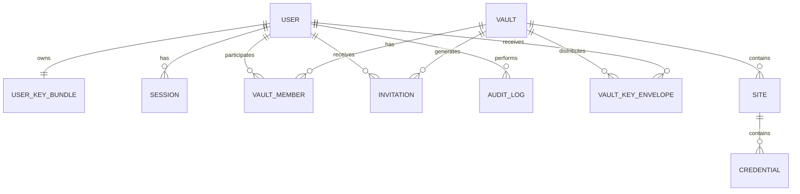

# DATABASE.md

# Cofre de Senhas — Banco de Dados

> **Status:** Estado da R0 — schema ainda sem entidades
> **Versão:** 0.1.0
> **Última atualização:** 5 de agosto de 2026

---

## 1. Objetivo

Este documento descreve o banco de dados do cofre de senhas: configuração, convenções, entidades e comportamento de exclusão.

Ele é a fonte de verdade do schema. Toda alteração em `apps/api/prisma/schema.prisma` deve atualizar este documento no mesmo pull request (`CLAUDE.md` secao 43).

---

## 2. Estado atual

**O schema não possui entidades ainda.**

`apps/api/prisma/schema.prisma` contém apenas `datasource` e `generator`. Não existe nenhuma migration.

Isso é intencional. As chaves primárias de todas as tabelas dependem de três decisões ainda abertas, e criá-las agora significaria uma migration destrutiva logo em seguida — em um banco que, a partir da R1.0, guarda material criptográfico insubstituível:

| Pendência | Tema                                | Impacto se decidido depois                           |
| --------- | ----------------------------------- | ---------------------------------------------------- |
| PEND-005  | UUIDv4 ou UUIDv7                    | Ordenação e localidade de índice de todas as tabelas |
| PEND-006  | `CHAR(36)` ou `BINARY(16)`          | Tipo de toda chave primária e estrangeira            |
| PEND-014  | Política de hard delete/soft delete | Colunas de exclusão e comportamento de todas as FKs  |

As entidades entram na **R0.2** (identidade) e **R0.3** (cofres), depois que essas decisões virarem ADR.

O readiness probe (`GET /api/v1/health/ready`) verifica a conexão com `SELECT 1`, justamente por não depender de nenhuma tabela. A verificação do estado das migrations entra junto com a primeira migration.

---

## 3. Configuração

| Item          | Valor                                 |
| ------------- | ------------------------------------- |
| SGBD          | MySQL 8                               |
| Engine        | InnoDB                                |
| Charset       | `utf8mb4`                             |
| Collation     | `utf8mb4_0900_ai_ci`                  |
| Timezone      | UTC                                   |
| ORM           | Prisma                                |
| Migrations    | `prisma migrate deploy` nos ambientes |
| Acesso        | apenas o backend, pela rede privada   |
| Porta pública | não existe, em nenhum ambiente        |

Cada ambiente tem um recurso MySQL próprio no Coolify: `mysql-development`, `mysql-staging` e `mysql-production`. Eles não compartilham volume, credencial nem backup.

O usuário de aplicação recebe privilégio mínimo. Ele não precisa de `SUPER`, `FILE` nem de permissão para criar outros usuários.

---

## 4. Regra permanente de conteúdo

**Nenhuma coluna em texto aberto** para:

- nome do cofre;
- descrição do cofre;
- nome do site;
- link do site;
- usuário da credencial;
- senha da credencial;
- observação da credencial;
- `VaultKey`;
- chave privada do usuário.

Esses valores existem apenas como blobs criptografados no cliente (ADR 0003). Uma coluna em texto aberto para qualquer um deles é um defeito de segurança, não uma otimização.

O que o banco **pode** armazenar em texto aberto: identificadores, e-mail, nome de perfil, papel do membro, status de convite, timestamps, versões, chave pública, IP, user agent e eventos de auditoria.

---

## 5. Convenções

### Identificadores

Todo ID público é UUID. IDs sequenciais não são usados como identificador externo — não como medida de segurança, mas para não facilitar enumeração e inferência de volume. A autorização continua sendo verificada em toda consulta, independentemente do formato do ID.

Formato exato pendente (`PEND-005`, `PEND-006`).

### Nomes

- tabelas no plural, em `snake_case`;
- colunas em `snake_case`;
- chave estrangeira nomeada como `<entidade>_id`;
- índice nomeado explicitamente quando não for gerado pelo Prisma.

### Timestamps

Todas as tabelas relevantes têm `created_at` e `updated_at` em UTC.

### Versão

`Vault`, `Site` e `Credential` têm coluna `version`, usada para concorrência otimista. Toda mutação bem-sucedida incrementa a versão exatamente uma vez; uma atualização só é aplicada quando `version` no banco é igual ao `expectedVersion` enviado pelo cliente.

---

## 6. Modelo conceitual previsto



As colunas de cada entidade serão detalhadas aqui conforme forem implementadas.

---

## 7. Exclusões

A política de hard delete versus soft delete por entidade está em aberto (`PEND-014`). Duas restrições já valem, independentemente do que for decidido:

1. **Segredo excluído não pode permanecer acessível pela aplicação.** Um cofre ou credencial marcado como excluído não pode continuar retornando `encryptedPayload` por nenhuma rota.
2. **Auditoria não é apagada junto com a entidade.** O registro de que algo foi excluído precisa sobreviver à exclusão.

`ON DELETE CASCADE` não é aplicado indiscriminadamente. Cada relação terá o comportamento decidido e documentado individualmente.

---

## 8. Migrations

### Regras

- toda migration é versionada e revisada em pull request;
- `prisma migrate deploy` nos ambientes; `prisma db push` nunca em produção;
- testada em banco vazio **e** em banco com dados;
- migration destrutiva exige backup prévio, autorização explícita e rollback documentado;
- a migration roda antes de o tráfego chegar à versão que depende dela.

### Ordem por ambiente

```text
development  → validação inicial
staging      → validação antes da aprovação da RC
production   → mesma migration, depois de backup
```

Mudança destrutiva usa estratégia expand/contract quando houver risco de indisponibilidade.

---

## 9. Backups

- backup automatizado por ambiente;
- criptografado;
- armazenado fora da VPS quando possível;
- retenção definida por ambiente;
- **restauração testada** antes da R1.0 — um backup nunca restaurado não é um backup.

Um backup do banco contém apenas dados criptografados. Sem a senha do usuário e a chave privada correspondente, ele não permite recuperar conteúdo. Isso é o comportamento esperado, não uma falha.

Os secrets do servidor têm backup próprio, separado do banco.

---

## 10. Checklist para adicionar uma tabela

Retirado de `CLAUDE.md` secao 80:

- [ ] Confirmar que nenhuma coluna guarda conteúdo sensível em texto aberto.
- [ ] Criar o model no `schema.prisma`.
- [ ] Criar a migration.
- [ ] Definir chaves estrangeiras.
- [ ] Revisar índices, incluindo os necessários para as consultas de autorização.
- [ ] Definir o comportamento de exclusão.
- [ ] Testar em banco vazio.
- [ ] Testar em banco existente.
- [ ] Atualizar este documento.
- [ ] Criar ADR quando a decisão for estrutural.

---

## 11. Referências

- `docs/ARCHITECTURE.md` secoes 12 e 32
- `docs/decisions/0008-mysql-prisma.md`
- `docs/decisions/0003-client-side-encryption.md`
- `docs/DECISIONS.md` PEND-005, PEND-006, PEND-014, PEND-015
- `CLAUDE.md` secoes 41 a 45
