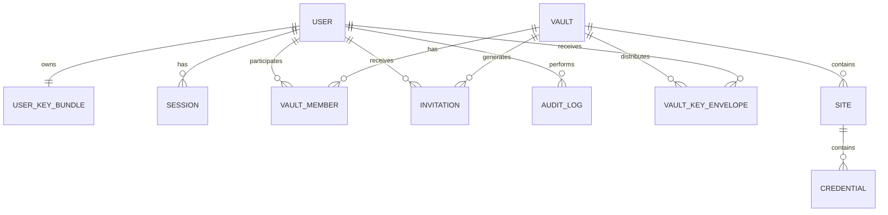

# DATABASE.md

# Crypta — Banco de Dados

> **Status:** Estado da R0.3 — identidade e cofres implementados
> **Versão:** 0.2.0
> **Última atualização:** 11 de agosto de 2026

---

## 1. Objetivo

Este documento descreve o banco de dados do cofre de senhas: configuração, convenções, entidades e comportamento de exclusão.

Ele é a fonte de verdade do schema. Toda alteração em `apps/api/prisma/schema.prisma` deve atualizar este documento no mesmo pull request (`CLAUDE.md` secao 43).

---

## 2. Estado atual

**O schema tem as três entidades de identidade, a tabela de idempotência e as quatro entidades da R0.3.**

`apps/api/prisma/schema.prisma` define `User`, `UserKeyBundle`, `Session`, `IdempotencyRecord`, `Vault`, `VaultMember`, `VaultKeyEnvelope` e `AuditLog`. As duas migrations do projeto, `20260808181037_identity` e `20260811203308_vaults`, foram aplicadas e testadas em banco vazio e em banco com dados.

Ficou parado até aqui de propósito: as chaves primárias dependiam de três decisões abertas, e criá-las antes significaria uma migration destrutiva logo em seguida — em um banco que, a partir da R1.0, guarda material criptográfico insubstituível.

**As três foram fechadas em 7 de agosto de 2026, e a estas se somaram as decisões de credencial:**

| Pendência | Tema                                | Resolução                                                       |
| --------- | ----------------------------------- | --------------------------------------------------------------- |
| PEND-005  | UUIDv4 ou UUIDv7                    | UUIDv7 ([ADR 0019](decisions/0019-database-identifiers.md))     |
| PEND-006  | `CHAR(36)` ou `BINARY(16)`          | `CHAR(36)` ([ADR 0019](decisions/0019-database-identifiers.md)) |
| PEND-014  | Política de hard delete/soft delete | Exclusão física ([ADR 0020](decisions/0020-deletion-policy.md)) |
| PEND-026  | Credenciais e tokens no servidor    | [ADR 0022](decisions/0022-server-side-credentials.md)           |

As entidades de cofre entraram na migration `20260811203308_vaults`, aplicada e testada em banco vazio e em banco com dados: `vaults`, `vault_members`, `vault_key_envelopes` e `audit_logs`. A última veio do `BLG-0506` por decisão registrada no `BLG-0503`.

O readiness probe (`GET /api/v1/health/ready`) verifica a conexão com `SELECT 1` **e** o estado das migrations em `_prisma_migrations`. A segunda checagem passou a existir junto com esta migration: banco alcançável com schema errado é pior do que banco fora do ar, porque a instância aceitaria tráfego e falharia por dentro.

---

## 3. Configuração

| Item          | Valor                                 |
| ------------- | ------------------------------------- |
| SGBD          | MySQL 8                               |
| Engine        | InnoDB                                |
| Charset       | `utf8mb4`                             |
| Collation     | `utf8mb4_0900_ai_ci`                  |
| Timezone      | UTC                                   |
| ORM           | Prisma                                |
| Migrations    | `prisma migrate deploy` nos ambientes |
| Acesso        | apenas o backend, pela rede privada   |
| Porta pública | não existe, em nenhum ambiente        |

Cada ambiente tem um recurso MySQL próprio no Coolify: `mysql-development`, `mysql-staging` e `mysql-production`. Eles não compartilham volume, credencial nem backup.

O usuário de aplicação recebe privilégio mínimo. Ele não precisa de `SUPER`, `FILE` nem de permissão para criar outros usuários. Precisa de DDL no próprio banco, porque `prisma migrate deploy` roda no start do container (ADR 0015).

### A collation não vem de graça

**O Prisma emite `COLLATE utf8mb4_unicode_ci` em toda tabela MySQL que gera, e não existe forma de declarar outra collation no `schema.prisma`.** A tabela acima exige `utf8mb4_0900_ai_ci`, que é a default do MySQL 8.

Isso significa que **toda migration precisa ser corrigida à mão** antes de entrar no pull request. Não é preferência: misturar as duas collations produz `Illegal mix of collations` em qualquer `JOIN` entre uma tabela de uma migration e outra de outra — um erro que só aparece na consulta que junta as duas, possivelmente meses depois.

A correção é uma substituição:

```sql
-- gerado pelo Prisma
) DEFAULT CHARACTER SET utf8mb4 COLLATE utf8mb4_unicode_ci;

-- o que deve ir para o repositório
) DEFAULT CHARACTER SET utf8mb4 COLLATE utf8mb4_0900_ai_ci;
```

`_prisma_migrations` é criada pelo próprio Prisma e permanece em `utf8mb4_unicode_ci`. É bookkeeping da ferramenta, nunca entra em `JOIN` com tabela do domínio, e não deve ser alterada.

### Banco de testes

Os testes de integração rodam contra MySQL real (`CLAUDE.md` secao 42), com a conexão em `TEST_DATABASE_URL` — separada de `DATABASE_URL` de propósito, porque a suíte apaga tabelas. O harness recusa rodar se o nome do banco não terminar em `_test`.

```bash
docker run -d --name crypta-mysql-test \
  -e MYSQL_ROOT_PASSWORD=crypta_local_test -e MYSQL_DATABASE=crypta_test \
  -p 3308:3306 mysql:8.0 \
  --character-set-server=utf8mb4 --collation-server=utf8mb4_0900_ai_ci \
  --default-time-zone=+00:00

pnpm --filter @crypta/api run prisma:migrate:deploy
pnpm --filter @crypta/api test:e2e
```

Não existe arquivo Docker Compose versionado, e não é distração: a ausência dele é item verificado do gate de saída da R0.1. Na CI o mesmo MySQL vem de um bloco `services:` no job `Testes de integração com MySQL`.

---

## 4. Regra permanente de conteúdo

**Nenhuma coluna em texto aberto** para:

- nome do cofre;
- descrição do cofre;
- nome do site;
- link do site;
- usuário da credencial;
- senha da credencial;
- observação da credencial;
- `VaultKey`;
- chave privada do usuário.

Esses valores existem apenas como blobs criptografados no cliente (ADR 0003). Uma coluna em texto aberto para qualquer um deles é um defeito de segurança, não uma otimização.

O que o banco **pode** armazenar em texto aberto: identificadores, e-mail, nome de perfil, papel do membro, status de convite, timestamps, versões, chave pública, IP, user agent e eventos de auditoria.

Duas colunas merecem nota porque parecem violar a regra e não violam:

- **`users.auth_secret_hash`** não é o `AuthSecret`. É `HMAC-SHA-256(pepper, authSecret)`, com o pepper derivado de `AUTH_SERVER_SECRET` e mantido **fora do banco** (ADR 0022). Um dump não permite autenticar nem iniciar o ataque offline contra a senha.
- **`user_key_bundles.public_key`** é pública por construção: é ela que os outros membros usam para endereçar envelopes. A metade privada está em `encrypted_private_key`, e a AAD do bundle amarra as duas (ADR 0023).

---

## 5. Convenções

### Identificadores

Todo ID público é UUID. IDs sequenciais não são usados como identificador externo — não como medida de segurança, mas para não facilitar enumeração e inferência de volume. A autorização continua sendo verificada em toda consulta, independentemente do formato do ID.

O formato é **UUIDv7 em `CHAR(36)`**, gerado pelo Prisma (ADR 0019):

```prisma
id String @id @default(uuid(7)) @db.Char(36)
```

Chaves estrangeiras usam o mesmo tipo. A v7 embute o instante de criação em milissegundos — é metadado que a v4 não entregaria, avaliado e aceito no ADR.

#### Quem gera o id

O formato é o mesmo em toda tabela. A **origem** não é, e o [ADR 0025](decisions/0025-client-generated-identifiers.md) fixa a exceção:

| Tabela                            | Origem do id | Por quê                                                           |
| --------------------------------- | ------------ | ----------------------------------------------------------------- |
| `users`, `user_key_bundles`       | Prisma       | Nada aqui é cifrado com AAD amarrada ao id                        |
| `sessions`, `idempotency_records` | Prisma       | Idem                                                              |
| `audit_logs`                      | Prisma       | Idem                                                              |
| `vaults`                          | **Cliente**  | A AAD da metadata amarra ao id, e o cliente cifra antes do `POST` |
| `sites`, `credentials` — R0.4     | **Cliente**  | Mesmo motivo                                                      |

Nas tabelas de origem cliente a coluna **não tem `@default`**:

```prisma
id String @id @db.Char(36)
```

A ausência é deliberada. Com `@default`, um `INSERT` sem id gravaria uma linha cujo conteúdo cifrado ninguém consegue abrir — o cliente montou a AAD com um id que o banco descartou. Sem ele, a falha é imediata e alta.

### Nomes

- tabelas no plural, em `snake_case`;
- colunas em `snake_case`;
- chave estrangeira nomeada como `<entidade>_id`;
- índice nomeado explicitamente quando não for gerado pelo Prisma.

### Timestamps

Todas as tabelas relevantes têm `created_at` e `updated_at` em UTC, em `DATETIME(3)`.

`sessions` é a exceção deliberada: tem `created_at` e `last_used_at`, e não `updated_at`. As duas colunas são âncoras de prazo, não metadados de auditoria — `created_at` para o teto absoluto e `last_used_at` para a inatividade (ADR 0021).

### Prazo não é coluna

**Nenhum vencimento é gravado.** Inatividade e teto absoluto são calculados na consulta, a partir de `last_used_at` e `created_at` com os valores de ambiente vigentes.

Gravar `expires_at` congelaria a configuração no instante do login: apertar `REFRESH_TOKEN_TTL` deixaria de valer para as sessões já abertas, e o ADR 0021 descreve exatamente o oposto — "sessões acima do novo limite passam a ser recusadas na próxima requisição".

### Versão

`Vault`, `Site` e `Credential` terão coluna `version`, usada para concorrência otimista. Toda mutação bem-sucedida incrementa a versão exatamente uma vez; uma atualização só é aplicada quando `version` no banco é igual ao `expectedVersion` enviado pelo cliente. Entra na R0.3.

---

## 6. Modelo conceitual previsto



As colunas das entidades ainda não implementadas serão detalhadas aqui conforme forem entrando.

---

## 6.1 Entidades implementadas

### `users`

| Coluna                  | Tipo                  | Notas                                               |
| ----------------------- | --------------------- | --------------------------------------------------- |
| `id`                    | `CHAR(36)` PK         | UUIDv7                                              |
| `name`                  | `VARCHAR(120)`        | nome de perfil; limite igual ao `displayNameSchema` |
| `email`                 | `VARCHAR(254)` UNIQUE | normalizado em minúsculas antes de gravar           |
| `auth_secret_hash`      | `CHAR(64)`            | `HMAC-SHA-256(pepper, authSecret)` em hexadecimal   |
| `auth_secret_version`   | `SMALLINT UNSIGNED`   | versão do `AUTH_SERVER_SECRET` que gerou o hash     |
| `is_active`             | `BOOLEAN`             | conta desativada não autentica                      |
| `failed_login_attempts` | `SMALLINT UNSIGNED`   | falhas consecutivas; zera no sucesso                |
| `locked_until`          | `DATETIME(3)` NULL    | instante de liberação; nunca permanente             |
| `created_at`            | `DATETIME(3)`         |                                                     |
| `updated_at`            | `DATETIME(3)`         |                                                     |

`auth_secret_version` existe para que rotacionar o `AUTH_SERVER_SECRET` não exija que ninguém troque de senha: o login confere com a versão gravada na linha e regrava com a corrente quando divergem (ADR 0022).

### `user_key_bundles`

1:1 com `users`, por `UNIQUE` em `user_id`. `ON DELETE CASCADE`.

| Coluna                  | Tipo                 | Notas                             |
| ----------------------- | -------------------- | --------------------------------- |
| `id`                    | `CHAR(36)` PK        | UUIDv7                            |
| `user_id`               | `CHAR(36)` UNIQUE FK | → `users.id`, `Cascade`           |
| `kdf_algorithm`         | `VARCHAR(32)`        | `ARGON2ID`                        |
| `kdf_version`           | `SMALLINT UNSIGNED`  | versão do conjunto de parâmetros  |
| `kdf_salt`              | `VARCHAR(32)`        | base64url de 16 bytes             |
| `kdf_memory`            | `INT UNSIGNED`       | KiB; 64 MiB são 65536             |
| `kdf_iterations`        | `SMALLINT UNSIGNED`  |                                   |
| `kdf_parallelism`       | `SMALLINT UNSIGNED`  | fixo em 1 (ADR 0016)              |
| `public_key`            | `VARCHAR(43)`        | X25519 em base64url               |
| `encrypted_private_key` | `VARCHAR(255)`       | cifrada com a `UserEncryptionKey` |
| `private_key_nonce`     | `VARCHAR(32)`        | base64url de 24 bytes             |
| `crypto_version`        | `SMALLINT UNSIGNED`  |                                   |
| `schema_version`        | `SMALLINT UNSIGNED`  |                                   |
| `created_at`            | `DATETIME(3)`        |                                   |
| `updated_at`            | `DATETIME(3)`        |                                   |

Os parâmetros KDF ficam por usuário, e não em configuração global, por duas razões: o cliente precisa deles **antes** de autenticar, e recalibrar o Argon2id (ADR 0018) não pode invalidar conta existente.

### `sessions`

| Coluna                | Tipo                | Notas                                               |
| --------------------- | ------------------- | --------------------------------------------------- |
| `id`                  | `CHAR(36)` PK       | é o `sid` que o access token carrega                |
| `user_id`             | `CHAR(36)` FK       | → `users.id`, `Cascade`; indexado                   |
| `family_id`           | `CHAR(36)`          | agrupa as rotações; indexado                        |
| `refresh_token_hash`  | `CHAR(64)` UNIQUE   | `SHA-256` em hexadecimal; a busca é por este índice |
| `previous_token_hash` | `CHAR(64)` NULL     | janela de tolerância de 10 s; indexado              |
| `rotated_at`          | `DATETIME(3)` NULL  | quando `previous_token_hash` foi rotacionado        |
| `client_type`         | `VARCHAR(16)`       | `web`, `android` ou `extension`                     |
| `client_name`         | `VARCHAR(120)` NULL | exibido na tela de sessões                          |
| `ip_address`          | `VARCHAR(45)` NULL  | IPv6 cabe em 45 caracteres                          |
| `user_agent`          | `VARCHAR(255)` NULL |                                                     |
| `created_at`          | `DATETIME(3)`       | âncora do teto absoluto; nenhuma rotação a move     |
| `last_used_at`        | `DATETIME(3)`       | âncora da inatividade; cada rotação a renova        |

**Não existe coluna de revogação.** Revogar é apagar a linha (ADR 0020). Um `revoked_at` traria de volta o problema que a exclusão física resolve: bastaria um `findMany` sem o filtro para uma sessão revogada voltar a valer.

> **Fechado pelo [ADR 0024](decisions/0024-rotation-grace-window.md).** O ADR 0021 dizia que, dentro da janela de 10 segundos, o refresh "devolve o mesmo par que a rotação original emitiu" — o que exigiria guardar o token em texto aberto, o oposto do que `refresh_token_hash` existe para fazer. Dentro da janela a rotação acontece de novo e o par é **novo**; `last_used_at` não é movido, então a inatividade não é estendida. Estas colunas servem exatamente a isso.

### `idempotency_records`

Sem chave estrangeira, pelo mesmo motivo do `AuditLog` no ADR 0020: o registro precisa sobreviver à exclusão da entidade que descreve.

| Coluna            | Tipo                | Notas                                              |
| ----------------- | ------------------- | -------------------------------------------------- |
| `id`              | `CHAR(36)` PK       | UUIDv7                                             |
| `scope`           | `VARCHAR(64)`       | operação a que a chave pertence; parte do `UNIQUE` |
| `idempotency_key` | `VARCHAR(255)`      | valor do header; parte do `UNIQUE`                 |
| `request_hash`    | `CHAR(64)`          | `SHA-256` do payload canônico                      |
| `resource_id`     | `CHAR(36)` NULL     | recurso criado, quando houve um; sem FK            |
| `response_status` | `SMALLINT UNSIGNED` |                                                    |
| `created_at`      | `DATETIME(3)`       |                                                    |

**Não guarda corpo de resposta.** O `POST /setup` responde com um access token, e gravá-lo transformaria esta tabela em depósito de credencial viva: um dump devolveria sessões utilizáveis. O replay reconstrói a resposta a partir de `resource_id` e emite um access token novo.

Mesma chave com `request_hash` diferente é `409 IDEMPOTENCY_CONFLICT`, não um replay silencioso (`CLAUDE.md` secao 38).

A tabela cresce sem limite e ninguém a limpa hoje. A retenção entra junto com a de auditoria, em `PEND-015`.

---

### `vaults`

O servidor não sabe como o cofre se chama. Nome e descrição vivem cifrados com a `VaultKey`, que ele nunca recebe.

| Coluna                | Tipo                | Notas                                                             |
| --------------------- | ------------------- | ----------------------------------------------------------------- |
| `id`                  | `CHAR(36)` PK       | UUIDv7 **gerado pelo cliente**, sem `DEFAULT` (ADR 0025)          |
| `metadata_nonce`      | `VARCHAR(32)`       | nonce da XChaCha20-Poly1305 em base64url                          |
| `metadata_ciphertext` | `TEXT`              | nome e descrição cifrados, em base64url                           |
| `metadata_algorithm`  | `VARCHAR(32)`       | algoritmo declarado do payload                                    |
| `crypto_version`      | `SMALLINT UNSIGNED` |                                                                   |
| `schema_version`      | `SMALLINT UNSIGNED` |                                                                   |
| `version`             | `INT UNSIGNED`      | concorrência otimista; toda mutação incrementa exatamente uma vez |
| `key_version`         | `INT UNSIGNED`      | geração da `VaultKey`; incrementa a cada rekey na R0.5            |
| `created_at`          | `DATETIME(3)`       |                                                                   |
| `updated_at`          | `DATETIME(3)`       |                                                                   |

`metadata_ciphertext` é `TEXT` e não `VARCHAR`: o limite do formato — 200 caracteres de nome e 2000 de descrição — chega a cerca de 12 mil caracteres depois de UTF-8, tag e base64url, e uma `VARCHAR` desse tamanho competiria com o limite de linha do InnoDB.

### `vault_members`

| Coluna           | Tipo                      | Notas                                                  |
| ---------------- | ------------------------- | ------------------------------------------------------ |
| `id`             | `CHAR(36)` PK             | UUIDv7                                                 |
| `vault_id`       | `CHAR(36)` FK → `vaults`  | `ON DELETE CASCADE`                                    |
| `user_id`        | `CHAR(36)` FK → `users`   | `ON DELETE RESTRICT` (ADR 0020)                        |
| `role`           | `ENUM('OWNER', 'EDITOR')` | papéis da V1                                           |
| `owner_vault_id` | `CHAR(36)` NULL `UNIQUE`  | espelha `vault_id` apenas na linha do dono; ver abaixo |
| `created_at`     | `DATETIME(3)`             |                                                        |
| `updated_at`     | `DATETIME(3)`             |                                                        |

`UNIQUE (vault_id, user_id)` impede associação duplicada.

#### Um dono por cofre é restrição de banco

`owner_vault_id` vale `vault_id` na linha do `OWNER` e é nulo nas demais. O índice único sobre ela recusa o segundo dono do mesmo cofre e ignora os nulos dos EDITORes.

**Quem preenche a coluna são dois gatilhos**, `vault_members_owner_before_insert` e `..._before_update`, e não a aplicação — assim o valor não depende de nenhum caminho de escrita lembrar de calculá-lo.

Os dois jeitos mais diretos não são possíveis nesta tabela, e falham com erro, não com aviso:

| Tentativa                 | Erro do MySQL                                                                      |
| ------------------------- | ---------------------------------------------------------------------------------- |
| Coluna gerada `STORED`    | `1215` — FK com `ON DELETE CASCADE` não pode incidir sobre a coluna base           |
| `CHECK` usando `vault_id` | `3823` — coluna necessária à ação referencial de uma FK não pode entrar em `CHECK` |

`vault_id` é justamente a coluna com o `CASCADE` que o ADR 0020 exige. Sobra o gatilho, que reproduz a mesma semântica onde o MySQL permite.

**Prisma não modela gatilho.** Os dois existem apenas na migration e aqui; um drift reportado por `prisma migrate dev` deve ser resolvido preservando-os.

### `vault_key_envelopes`

`VaultKey` cifrada para a chave pública de um membro. O servidor guarda e não abre.

| Coluna                 | Tipo                     | Notas                                           |
| ---------------------- | ------------------------ | ----------------------------------------------- |
| `id`                   | `CHAR(36)` PK            | UUIDv7                                          |
| `vault_id`             | `CHAR(36)` FK → `vaults` | `ON DELETE CASCADE`                             |
| `user_id`              | `CHAR(36)` FK → `users`  | `ON DELETE RESTRICT`                            |
| `key_version`          | `INT UNSIGNED`           | geração da `VaultKey` que este envelope entrega |
| `crypto_version`       | `SMALLINT UNSIGNED`      |                                                 |
| `algorithm`            | `VARCHAR(64)`            | `X25519-HKDF-SHA256-XCHACHA20-POLY1305`         |
| `ephemeral_public_key` | `VARCHAR(43)`            | chave pública X25519 efêmera em base64url       |
| `encrypted_vault_key`  | `VARCHAR(255)`           | `VaultKey` cifrada com a tag, em base64url      |
| `created_at`           | `DATETIME(3)`            |                                                 |
| `updated_at`           | `DATETIME(3)`            |                                                 |

`UNIQUE (vault_id, user_id, key_version)`: um envelope por membro por geração.

**Não existe coluna `nonce`**, e a ausência é decisão do ADR 0023: ele é derivado junto com a chave da AEAD e não trafega. Guardá-lo criaria uma segunda fonte de verdade capaz de discordar da primeira.

### `audit_logs`

**Sem chave estrangeira**, de propósito (ADR 0020): como a exclusão é física, é esta tabela que guarda a prova de que algo existiu e foi apagado. Uma FK a apagaria junto com a entidade, e `ON DELETE SET NULL` destruiria justamente o `actor_id` que a auditoria existe para guardar.

| Coluna        | Tipo            | Notas                                   |
| ------------- | --------------- | --------------------------------------- |
| `id`          | `CHAR(36)` PK   | UUIDv7                                  |
| `actor_id`    | `CHAR(36)` NULL | quem executou, como valor e não como FK |
| `action`      | `VARCHAR(64)`   | verbo estável, ex.: `VAULT_CREATED`     |
| `entity_type` | `VARCHAR(32)`   |                                         |
| `entity_id`   | `CHAR(36)` NULL |                                         |
| `vault_id`    | `CHAR(36)` NULL |                                         |
| `request_id`  | `VARCHAR(64)`   | correlaciona com o log estruturado      |
| `ip_address`  | `VARCHAR(45)`   |                                         |
| `user_agent`  | `VARCHAR(255)`  |                                         |
| `result`      | `VARCHAR(16)`   | `SUCCESS` ou `FAILURE`                  |
| `created_at`  | `DATETIME(3)`   |                                         |

Nada de conteúdo entra aqui: nome de cofre, senha, observação e ciphertext estão proibidos (`ARCHITECTURE.md` secao 33.3).

A tabela veio do `BLG-0506` para o `BLG-0503` porque a R0.3 já exclui cofres, e a exclusão física do ADR 0020 só se sustenta com uma auditoria que sobreviva à entidade. A retenção continua em `PEND-015`.

---

## 7. Exclusões

A política é **exclusão física**, sem `deleted_at` e sem filtro de exclusão em consulta (ADR 0020). Ela atende às duas restrições que já valiam:

1. **Segredo excluído não pode permanecer acessível pela aplicação.** Um cofre ou credencial marcado como excluído não pode continuar retornando `encryptedPayload` por nenhuma rota.
2. **Auditoria não é apagada junto com a entidade.** O registro de que algo foi excluído precisa sobreviver à exclusão.

A segunda é atendida por `AuditLog` ser tabela independente, sem chave estrangeira: ela guarda `actor_id` e `entity_id` como valores, então apagar a entidade não tem como apagar o registro.

`ON DELETE CASCADE` não é aplicado indiscriminadamente. O comportamento de cada relação está declarado no [ADR 0020](decisions/0020-deletion-policy.md) — com destaque para `User` → `VaultMember`, que é `Restrict` para que excluir um proprietário não deixe cofre órfão.

---

## 8. Migrations

### Regras

- toda migration é versionada e revisada em pull request;
- `prisma migrate deploy` nos ambientes; `prisma db push` nunca em produção;
- testada em banco vazio **e** em banco com dados;
- migration destrutiva exige backup prévio, autorização explícita e rollback documentado;
- a migration roda antes de o tráfego chegar à versão que depende dela.

### Ordem por ambiente

```text
development  → validação inicial
staging      → validação antes da aprovação da RC
production   → mesma migration, depois de backup
```

Mudança destrutiva usa estratégia expand/contract quando houver risco de indisponibilidade.

---

## 9. Backups

- backup automatizado por ambiente;
- criptografado;
- armazenado fora da VPS quando possível;
- retenção definida por ambiente;
- **restauração testada** antes da R1.0 — um backup nunca restaurado não é um backup.

Um backup do banco contém apenas dados criptografados. Sem a senha do usuário e a chave privada correspondente, ele não permite recuperar conteúdo. Isso é o comportamento esperado, não uma falha.

Os secrets do servidor têm backup próprio, separado do banco.

---

## 10. Checklist para adicionar uma tabela

Retirado de `CLAUDE.md` secao 80:

- [ ] Confirmar que nenhuma coluna guarda conteúdo sensível em texto aberto.
- [ ] Criar o model no `schema.prisma`.
- [ ] Criar a migration.
- [ ] Definir chaves estrangeiras.
- [ ] Revisar índices, incluindo os necessários para as consultas de autorização.
- [ ] Definir o comportamento de exclusão.
- [ ] Testar em banco vazio.
- [ ] Testar em banco existente.
- [ ] **Acrescentar a tabela a `TABLES`, em `apps/api/test/support/database.ts`**, na posição topológica certa.
- [ ] Atualizar este documento.
- [ ] Criar ADR quando a decisão for estrutural.
- [ ] Se a migration usar gatilho, conferir `config_user.md` secao 18 **para cada ambiente**.

Os dois itens novos vêm de defeitos reais, e nenhum dos dois falha no lugar onde é causado.

**`TABLES` esquecida** não quebra nada de imediato: a suíte continua verde e passa a vazar estado entre specs, e a falha aparece depois, em um teste que não mudou. A R0.4 acrescenta um guard que compara a lista com `information_schema` e falha nomeando a diferença — enquanto ele não existir, esta linha da checklist é a única proteção.

**Gatilho sem provisionamento** derrubou development na R0.3 com `MySQL 1419`. Como DDL no MySQL não é transacional, a tentativa deixa as tabelas criadas e a migration registrada como falha, e todo deploy seguinte aborta com `P3009` antes de tentar. Development já foi liberado; **staging e produção não**.

---

## 11. Referências

- `docs/ARCHITECTURE.md` secoes 12 e 32
- `docs/decisions/0003-client-side-encryption.md` — por que o conteúdo é opaco ao servidor
- `docs/decisions/0008-mysql-prisma.md` — MySQL com Prisma
- `docs/decisions/0019-database-identifiers.md` — UUIDv7 em `CHAR(36)`
- `docs/decisions/0020-deletion-policy.md` — exclusão física e o `onDelete` de cada FK
- `docs/decisions/0021-session-token-lifetimes.md` — as duas âncoras de prazo em `sessions`
- `docs/decisions/0022-server-side-credentials.md` — o verificador do `AuthSecret` e o bloqueio
- `docs/decisions/0023-identity-aad-and-key-envelope.md` — o formato do key bundle
- `docs/DECISIONS.md` DEC-046, DEC-047, DEC-049, DEC-050 e PEND-015 (retenção, ainda aberta)
- `CLAUDE.md` secoes 41 a 45
