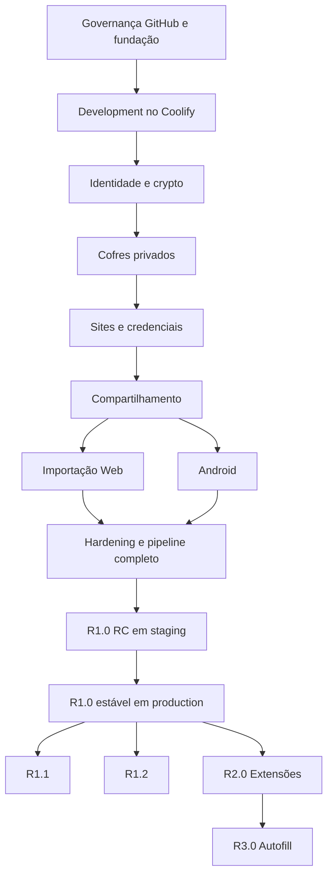

# ROADMAP.md

# Crypta — Roadmap do Produto

> **Status:** Roadmap inicial para revisão  
> **Versão:** 0.2.0  
> **Última atualização:** 31 de julho de 2026

---

## 1. Objetivo

Este documento organiza a evolução do cofre de senhas em releases e marcos.

O roadmap não representa promessa de data.

Ele define:

- ordem de entrega;
- dependências;
- gates;
- objetivos de cada release;
- funcionalidades previstas;
- funcionalidades fora de cada fase;
- critérios para avançar.

O backlog detalhado está em `BACKLOG.md`.

---

## 2. Visão do produto

O produto deverá evoluir de uma base técnica mínima até um cofre de senhas utilizável por Web e Android.

Estrutura principal:

```text
Usuário
→ Cofre privado ou compartilhado
→ Site
→ Credencial
```

Cada site possui:

- nome;
- link opcional;
- várias credenciais.

Cada credencial possui:

- usuário;
- senha;
- observação opcional.

---

## 3. Princípios do roadmap

### Segurança antes de conveniência

Nenhum release poderá avançar apenas por estar visualmente pronto.

### Deploy antecipado

O ambiente de testes no Coolify deverá existir desde a primeira integração real.

### Documentação contínua

Documentação acompanha o código.

### Mobile após estabilização da API e crypto

O Android utilizará a mesma API e os mesmos formatos criptográficos.

### Escopo controlado

Não adicionar novos tipos de credencial antes da estabilização do núcleo.

### Promoção imutável

Uma release normal será construída na RC e promovida para produção pelos mesmos digests homologados.

### Ambientes isolados

Development, staging e production terão recursos, bancos e secrets próprios.

### Branches com responsabilidade clara

- `develop`: integração;
- `staging`: homologação;
- `main`: produção;
- `release/*`: versão congelada;
- `fix/*`: correção de homologação;
- `hotfix/*`: correção de produção.

---

## 4. Visão das releases

```text
R0 — Governança, GitHub e fundação
R0.1 — Deploy antecipado em development
R0.2 — Identidade e criptografia
R0.3 — Cofres privados
R0.4 — Sites e credenciais
R0.5 — Compartilhamento
R0.6 — Importação Web
R0.7 — Android
R0.8 — Hardening e pipeline completo
R1.0 — Primeira versão estável utilizável

R1.1 — Qualidade de uso
R1.2 — Administração e recuperação
R2.0 — Extensões de navegador
R3.0 — Autofill Android e segurança avançada
```

### Ciclo de entrega de uma versão

```text
trabalho
→ develop
→ development

congelamento
→ release/x.y.z
→ staging
→ vX.Y.Z-rc.N
→ GitHub Pre-release

aprovação
→ staging → main
→ vX.Y.Z
→ GitHub Release
→ production
→ main → develop
```

### Regra de artefato

```text
RC constrói Web e API
→ GHCR registra os digests
→ staging homologa
→ production promove os mesmos digests
```

O detalhamento está em `GITHUB_RELEASE_FLOW.md`.

As configurações manuais estão em `config_user.md`.

# RELEASE R0 — GOVERNANÇA, GITHUB E FUNDAÇÃO

---

## 5. Objetivo

Criar uma base pública, protegida, reproduzível, testável e preparada para o fluxo completo de releases.

---

## 6. Entregas

### GitHub

- repositório público;
- branches `develop`, `staging` e `main`;
- `develop` como branch padrão;
- métodos de merge;
- GitHub Environments;
- labels;
- milestones;
- rulesets;
- proteção de tags;
- secret scanning;
- Dependabot;
- arquivo `VERSION`;
- `.github/release.yml`;
- `config_user.md`;
- `GITHUB_RELEASE_FLOW.md`.

### Workflows iniciais

- `ci.yml`;
- `validate-pr-flow.yml`;
- `cleanup-temporary-branches.yml`;
- esqueleto de `start-release.yml`;
- permissões mínimas das Actions.

### Fundação técnica

- monorepo;
- React + Vite;
- NestJS;
- MySQL + Prisma;
- packages compartilhados;
- TypeScript strict;
- lint;
- format;
- testes;
- documentação base;
- regras de segurança;
- ADRs iniciais.

---

## 7. Não inclui

- autenticação;
- criptografia funcional;
- cofres;
- credenciais;
- Android utilizável;
- staging operacional;
- production operacional.

---

## 8. Gate de saída

- configuração de `config_user.md` concluída para a fase;
- branches permanentes criadas;
- `develop` definido como padrão;
- PR inválido bloqueado;
- branch temporária correta pode ser apagada;
- `release/*` não é apagada automaticamente;
- `VERSION` validado;
- `pnpm install` funcional;
- lint passa;
- typecheck passa;
- testes de exemplo passam;
- Web builda;
- API builda;
- documentação principal versionada;
- nenhum segredo no repositório.

---

# RELEASE R0.1 — DEPLOY ANTECIPADO EM DEVELOPMENT

---

## 9. Objetivo

Validar a arquitetura real na VPS e o caminho GitHub Actions → GHCR → Coolify antes das funcionalidades críticas.

---

## 10. Entregas

### GitHub e GHCR

- Environment `development`;
- packages Web e API;
- tags `development` e `dev-<sha>`;
- workflow `deploy-development.yml`;
- metadata de build.

### Coolify

- projeto `crypta-development`;
- app Web;
- app API;
- `mysql-development`;
- domínios;
- HTTPS;
- rede privada.

### Integração

```text
Web
→ GET /api/v1/health/ready
→ API
→ mysql-development
```

Identificação:

```text
GET /api/v1/version
→ version
→ commit
→ environment
→ builtAt
```

### Infra

- Dockerfile Web;
- Dockerfile API;
- logs;
- health checks;
- variables;
- secrets;
- deploy automático.

---

## 11. Riscos validados

- build context do monorepo;
- autenticação no GHCR;
- disparo do Coolify;
- CORS;
- DNS;
- HTTPS;
- proxy;
- conexão com MySQL;
- migrations;
- env vars;
- rede;
- Nginx SPA fallback;
- metadata de versão.

---

## 12. Gate de saída

- Web acessível por HTTPS;
- API acessível por HTTPS;
- Web consulta API;
- API consulta MySQL;
- MySQL sem porta pública;
- imagem identificada por commit;
- `/api/v1/version` corresponde ao deployment;
- deploy automático por `develop`;
- rollback para um `dev-<sha>` anterior testado;
- nenhum Docker Compose usado.

---

# RELEASE R0.2 — IDENTIDADE E CRIPTOGRAFIA

---

## 13. Objetivo

Construir a fundação de confiança do produto.

---

## 14. Entregas de identidade

- setup inicial;
- parâmetros KDF;
- primeiro usuário;
- login;
- access token;
- refresh token;
- rotação;
- sessões;
- logout;
- alteração de senha.

---

## 15. Entregas de criptografia

- Argon2id;
- HKDF;
- RootKey;
- AuthSecret;
- UserEncryptionKey;
- keypair X25519;
- chave privada protegida;
- VaultKey;
- XChaCha20-Poly1305;
- envelopes;
- AAD;
- versionamento;
- vetores Web/Android.

---

## 16. Não inclui

- cofres compartilhados funcionais;
- rekey;
- importação;
- credenciais reais;
- Android completo.

---

## 17. Gate de segurança

- senha original não enviada à API;
- AuthSecret não logado;
- private key nunca enviada aberta;
- vetores passam;
- ciphertext adulterado falha;
- AAD incorreta falha;
- refresh reuse revoga sessão;
- localStorage não contém segredo;
- arquitetura revisada.

---

# RELEASE R0.3 — COFRES PRIVADOS

---

## 18. Objetivo

Permitir que um usuário crie e gerencie cofres privados.

---

## 19. Entregas

- dashboard;
- criar cofre;
- listar cofres;
- visualizar cofre;
- editar cofre;
- excluir cofre;
- VaultKey por cofre;
- envelope OWNER;
- snapshot;
- auditoria;
- concorrência.

---

## 20. Critérios funcionais

O usuário deverá conseguir:

1. entrar;
2. criar cofre;
3. sair;
4. entrar novamente;
5. recuperar envelope;
6. descriptografar metadata;
7. editar;
8. excluir.

---

## 21. Gate de saída

- API não conhece nome do cofre;
- OWNER único;
- acesso cruzado negado;
- version conflict testado;
- snapshot protegido;
- logs sanitizados.

---

# RELEASE R0.4 — SITES E CREDENCIAIS

---

## 22. Objetivo

Entregar o núcleo funcional do cofre.

---

## 23. Sites

- nome;
- link opcional;
- criar;
- listar;
- visualizar;
- editar;
- excluir.

---

## 24. Credenciais

- usuário;
- senha;
- observação;
- criar;
- listar;
- visualizar;
- editar;
- excluir;
- copiar usuário;
- copiar senha;
- revelar temporariamente.

---

## 25. Busca

- busca local;
- nome do site;
- usuário;
- sem observações;
- sem índice persistente.

---

## 25.1 Critérios funcionais

Roteiro executado **em navegador, contra development**, por uma pessoa que não precisa saber como a aplicação foi construída.

Cada passo é uma coisa que se vê na tela. O roteiro da R0.3 (secao 20) tinha dois passos escritos em termos de implementação — "recuperar envelope" e "descriptografar metadata" — e quem executou não teve como responder se passaram: não são coisas que aparecem em lugar nenhum da interface. O que se observa é o nome do cofre aparecendo depois de entrar de novo; o envelope e a decifragem são o mecanismo, e mecanismo é assunto do teste automatizado.

O usuário deverá conseguir:

1. entrar e abrir um cofre;
2. criar um site com nome e link, e vê-lo na lista do cofre;
3. criar um site sem link, e vê-lo na lista;
4. abrir o site e criar uma credencial com usuário, senha e observação;
5. ver a senha mascarada na lista, sem tê-la revelado;
6. revelar a senha, conferir que é a que foi digitada, e ver que ela volta a ficar oculta ao fechar;
7. copiar o usuário e colar em outro campo, obtendo o mesmo valor;
8. copiar a senha **sem revelá-la** e colar em outro campo, obtendo o mesmo valor;
9. editar a credencial, salvar, e ver o valor novo ao reabrir;
10. buscar pelo nome do site e ver a lista filtrar;
11. buscar pelo usuário de uma credencial e ver o site correspondente aparecer;
12. buscar por um trecho que só existe na observação e **não** encontrar nada;
13. sair, entrar de novo, abrir o mesmo cofre e ver site, credencial e observação preservados;
14. excluir a credencial e ver a lista do site esvaziar;
15. criar uma credencial nova, excluir o site inteiro, e ver o site sumir da lista do cofre;
16. recarregar a página no meio do trabalho e chegar a uma tela que diga o que fazer.

O passo 13 é o que prova o ciclo criptográfico inteiro sem mencionar nenhuma peça dele: se o conteúdo reaparece depois de sair e entrar, a chave foi selada, guardada, recuperada e aberta.

O passo 16 não tem resultado esperado fixado, e é deliberado: hoje o F5 perde as chaves e leva ao login, que cunha sessão nova. Se a decisão em aberto sobre destravar no reload for fechada antes da fase terminar, o passo passa a esperar a tela de destravar. O que o roteiro cobra em qualquer um dos casos é que a tela **diga alguma coisa**, em vez de voltar a um formulário sem explicação — que foi o defeito da R0.2.

---

## 26. Gate de saída

- banco sem conteúdo aberto;
- senha nunca em logs;
- senha mascarada por padrão;
- exclusão testada;
- autorização OWNER/EDITOR preparada;
- busca não persiste índice;
- clipboard revisado;
- E2E do cofre privado completo.

Os oito itens acima são objetivos. O que os torna verificáveis está na secao "Estado da R0.4" do `BACKLOG.md`, que é o gate único da fase: cada linha nasce `PENDENTE` e só vira `OK` com a evidência que a comprova.

A tabela é escrita **antes** do código, pela mesma razão da R0.3 — foi o critério por escrito que cobrou a escrita concorrente e a auditoria sem ciphertext, dois testes que ninguém teria escrito por conta própria.

---

# RELEASE R0.5 — COMPARTILHAMENTO

---

## 27. Objetivo

Permitir uso real por dois usuários com cofres privados e compartilhados.

---

## 28. Convites

- criar;
- listar;
- cancelar;
- abrir;
- aceitar;
- recusar;
- expirar;
- criar conta via convite.

---

## 29. Membership

- OWNER;
- EDITOR;
- acesso compartilhado;
- saída voluntária;
- bloqueio após remoção.

---

## 30. Criptografia compartilhada

- inviteToken;
- inviteSecret;
- segredo no fragmento;
- envelope por membro;
- envelope criado no cliente;
- API sem VaultKey.

---

## 31. Rekey

- iniciar;
- bloquear mutações;
- recriptografar;
- novos envelopes;
- remover membro;
- commit transacional;
- recuperação de falha.

---

## 32. Gate de segurança

- convite de uso único;
- convite vinculado ao e-mail;
- inviteSecret não chega à API;
- membro removido perde acesso;
- keyVersion incrementa;
- envelopes antigos removidos;
- rekey E2E passa;
- limitação de dados já copiados documentada.

---

# RELEASE R0.6 — IMPORTAÇÃO CSV WEB

---

## 33. Objetivo

Permitir migração inicial de credenciais sem enviar CSV em texto aberto ao servidor.

---

## 34. Entregas

- upload local;
- parser;
- arquivo modelo;
- validação;
- preview;
- cofres inexistentes;
- mapping;
- duplicidade;
- confirmação;
- criptografia;
- batch;
- idempotência;
- relatório.

---

## 35. Formato

```text
cofre,nome,usuario,senha,obs,link
```

`link` e `obs` opcionais.

---

## 36. Gate de segurança

- arquivo não enviado;
- senha não logada;
- limite de tamanho;
- limite de linhas;
- fórmulas tratadas como texto;
- dados temporários limpos;
- batch criptografado;
- falha parcial testada.

---

# RELEASE R0.7 — ANDROID

---

## 37. Objetivo

Entregar aplicativo Android instalável por APK.

---

## 38. Entregas

- React Native + Expo;
- splash;
- login;
- cofres;
- sites;
- credenciais;
- convites;
- sessões;
- conta;
- cópia;
- reveal;
- Keystore;
- build release;
- APK assinado.

---

## 39. Fora do escopo

- importação CSV;
- Android Autofill;
- biometria;
- modo offline;
- iOS.

---

## 40. Gate de segurança

- refresh token no Keystore;
- nada sensível em AsyncStorage;
- crypto compatível com Web;
- APK release;
- signing key fora do Git;
- hash publicado;
- screenshots sensíveis avaliados;
- testes em dois dispositivos.

---

# RELEASE R0.8 — HARDENING E PIPELINE COMPLETO

---

## 41. Objetivo

Preparar o sistema, os ambientes e a cadeia de entrega para armazenar credenciais reais e publicar a R1.0.

---

## 42. Segurança

- revisão de autorização;
- IDOR;
- rate limit;
- CSP;
- CSRF;
- headers;
- logs;
- secret scan;
- dependency audit;
- container scan;
- storage review;
- threat model review;
- revisão de workflows;
- revisão de permissions;
- proteção de tags;
- isolamento dos Environments;
- verificação de digests.

---

## 43. Operação

- projeto `crypta-staging`;
- projeto `crypta-production`;
- bancos independentes;
- domínios;
- secrets;
- backup;
- retenção;
- restore;
- jobs;
- health;
- readiness;
- `/api/v1/version`;
- documentação de incidentes;
- atualização da VPS;
- proteção do Coolify.

---

## 44. Pipeline de release

- `start-release.yml`;
- `publish-prerelease.yml`;
- `publish-production.yml`;
- criação de `release/x.y.z`;
- atualização do `VERSION`;
- tag `vX.Y.Z-rc.N`;
- GitHub Pre-release;
- imagens Web e API no GHCR;
- `release-manifest.json`;
- promoção pelos mesmos digests;
- tag `vX.Y.Z`;
- GitHub Release;
- sincronização `main → develop`;
- fluxo de hotfix;
- rollback.

---

## 45. Gate de saída

- backup restaurado com sucesso;
- três bancos privados e separados;
- nenhum segredo no repositório;
- secrets isolados por Environment;
- nenhum dado sensível em logs;
- E2E completo;
- rekey completo;
- refresh reuse testado;
- APK release testado;
- PR inválido bloqueado;
- RC de ensaio publicada;
- staging executa o digest esperado;
- production de ensaio promove o mesmo digest;
- migration validada em staging;
- rollback por tag ou digest testado;
- tag publicada não pode ser movida;
- checklist de produção aprovado.

---

# RELEASE R1.0 — PRIMEIRA VERSÃO ESTÁVEL UTILIZÁVEL

---

## 46. Objetivo

Publicar a primeira versão estável para uso real por dois usuários.

---

## 47. Escopo final

### Web

- setup;
- login;
- sessões;
- cofres;
- sites;
- credenciais;
- compartilhamento;
- importação CSV;
- configurações.

### Android

- login;
- cofres;
- sites;
- credenciais;
- compartilhamento;
- sessões;
- conta.

### Backend

- auth;
- autorização;
- crypto contracts;
- persistência;
- convites;
- importação;
- rekey;
- auditoria;
- operação.

### Entrega

```text
develop
→ release/1.0.0
→ staging
→ v1.0.0-rc.N
→ aprovação
→ main
→ v1.0.0
→ production
```

---

## 48. Condições para uso real

- todos os gates anteriores aprovados;
- credenciais fictícias usadas até a aprovação;
- milestone R1.0 concluído;
- RC aprovada em staging;
- imagens homologadas registradas no manifesto;
- produção utilizando os mesmos digests;
- tag estável imutável;
- GitHub Release publicada;
- backup externo ativo;
- restore testado;
- rollback testado;
- `/api/v1/version` validado;
- `main → develop` sincronizado;
- documentação atual;
- usuários entendem limitações;
- canal de convite definido;
- APK confiável instalado.

---

## 49. Não objetivos da R1.0

- extensão;
- autofill;
- iOS;
- arquivos;
- SSH keys;
- cartões;
- TOTP;
- offline;
- exportação;
- lixeira;
- histórico completo;
- perfil leitor;
- transferência de propriedade;
- recuperação avançada.

---

# RELEASE R1.1 — QUALIDADE DE USO

---

## 50. Objetivo

Melhorar conveniência sem alterar o modelo principal.

---

## 51. Candidatos

- gerador de senha;
- autolock;
- busca global;
- tela de auditoria;
- melhorias no clipboard;
- melhorias em importação;
- tema refinado;
- atalhos;
- melhor detecção de duplicidade;
- indicadores de força.

---

## 52. Gate

Nenhuma melhoria poderá:

- persistir dados abertos;
- reduzir segurança;
- alterar crypto sem ADR;
- criar analytics invasivo.

---

# RELEASE R1.2 — ADMINISTRAÇÃO E RECUPERAÇÃO

---

## 53. Objetivo

Adicionar recursos administrativos e de continuidade.

---

## 54. Candidatos

- perfil LEITOR;
- transferência de propriedade;
- lixeira;
- histórico de versões;
- exportação criptografada;
- kit de recuperação;
- contato de emergência;
- biometria Android;
- política de dispositivos confiáveis.

---

## 55. Decisões obrigatórias

Antes de implementar:

- modelo de recuperação;
- impacto zero-knowledge;
- retenção;
- formato de exportação;
- rotação de chave;
- permissões.

---

# RELEASE R2.0 — EXTENSÕES DE NAVEGADOR

---

## 56. Objetivo

Permitir consulta e preenchimento de credenciais em navegadores.

---

## 57. Plataformas

- Chrome;
- Firefox;
- Opera.

---

## 58. Entregas candidatas

- login;
- desbloqueio;
- pesquisa por domínio;
- seleção de credencial;
- preenchimento manual;
- preenchimento automático controlado;
- sessão própria;
- permissions mínimas;
- clipboard;
- atualização segura.

---

## 59. Riscos

- content scripts;
- página maliciosa;
- phishing;
- domínio semelhante;
- permissões excessivas;
- storage da extensão;
- atualização comprometida.

---

## 60. Gate de segurança

- threat model específico;
- manifest revisado;
- permissões mínimas;
- sem senha em storage aberto;
- confirmação de domínio;
- testes em todos os navegadores;
- assinatura/publicação confiável.

---

# RELEASE R3.0 — ANDROID AUTOFILL E SEGURANÇA AVANÇADA

---

## 61. Objetivo

Integrar o cofre ao fluxo de login do Android.

---

## 62. Entregas candidatas

- Android Autofill Service;
- detecção de app/domínio;
- seleção;
- biometria;
- timeout;
- prevenção de phishing;
- desbloqueio rápido;
- políticas por app.

---

## 63. Segurança avançada

- passkeys;
- recovery kit;
- trusted devices;
- notificações de segurança;
- rotação assistida;
- offline criptografado;
- sincronização incremental robusta.

---

## 64. Gate

- integração nativa revisada;
- identificação segura do app;
- biometria protegida;
- armazenamento local criptografado;
- threat model Android atualizado;
- testes em múltiplas versões do Android.

---

# 65. Linha de dependência



---

## 66. Marcos de validação

### Marco 0 — “GitHub pronto”

- branches permanentes;
- `develop` padrão;
- rulesets;
- Environments;
- `VERSION`;
- labels;
- milestones;
- workflows básicos;
- fluxo de PR validado.

### Marco A — “Funciona em development”

- Web;
- API;
- MySQL;
- GHCR;
- HTTPS;
- Coolify;
- deploy pelo commit;
- endpoint de versão.

### Marco B — “Identidade segura”

- setup;
- login;
- refresh;
- sessão;
- crypto básica.

### Marco C — “Cofre privado utilizável”

- cofre;
- site;
- credencial;
- busca;
- logout/login.

### Marco D — “Dois usuários”

- convite;
- acesso compartilhado;
- editor;
- remoção;
- rekey.

### Marco E — “Migração e mobile”

- CSV Web;
- Android APK.

### Marco F — “Release reproduzível”

- release branch;
- RC;
- Pre-release;
- GHCR;
- manifesto;
- staging;
- mesmos digests em production;
- GitHub Release;
- rollback.

### Marco G — “Pronto para credenciais reais”

- backup;
- restore;
- hardening;
- E2E;
- checklist;
- R1.0 estável.

---

## 67. Riscos de cronograma

### Configuração do GitHub

Rulesets, Environments, permissões ou recursos podem variar conforme o plano da conta.

### Integração GitHub Actions, GHCR e Coolify

Pode exigir ajustes de autenticação, visibilidade de packages e webhooks.

### Criptografia cross-platform

Pode exigir troca de biblioteca ou módulos nativos.

### Rekey

É um dos fluxos mais complexos.

### Cookies/CORS

Podem gerar problemas no deploy desacoplado e entre domínios de cada ambiente.

### Android Keystore

Pode exigir development build ou prebuild.

### Importação

Pode consumir memória em arquivos grandes.

### Migrations

Mudanças destrutivas podem exigir janela, backup e estratégia expand/contract.

### Repositório público

Exige disciplina contínua contra segredos e proteção da cadeia de entrega.

---

## 68. Estratégia de redução de risco

- configurar GitHub antes do desenvolvimento funcional;
- validar PRs permitidos e inválidos;
- deploy development cedo;
- publicar imagem por commit;
- testar crypto antes das features;
- criar vetores cross-platform;
- prototipar Keystore cedo;
- implementar rekey antes do uso real;
- criar staging e production antes da R1.0;
- realizar uma RC de ensaio;
- promover o mesmo digest;
- restaurar backup antes da R1.0;
- testar rollback;
- limitar CSV;
- manter escopo pequeno.

---

## 69. Métricas de progresso

Acompanhar por release:

- histórias concluídas;
- milestone concluído;
- testes passando;
- bugs P0/P1;
- cobertura de fluxos críticos;
- documentação atualizada;
- deployments bem-sucedidos;
- RCs publicadas;
- tempo entre RC e aprovação;
- divergências de digest;
- falhas de segurança;
- tempo de build;
- restauração validada;
- rollback validado.

---

## 70. Métricas de qualidade da R1.0

- zero bug P0 aberto;
- zero segredo no repositório;
- zero endpoint protegido sem teste de autorização;
- zero promoção de branch inválida;
- zero reconstrução entre RC aprovada e produção;
- 100% dos fluxos críticos E2E;
- restore validado;
- rollback validado;
- Web e Android compatíveis;
- rekey validado;
- logs revisados;
- tag estável imutável;
- produção identificada por versão, commit e digest;
- documentação atual.

---

## 71. Política de mudança do roadmap

Uma mudança deverá ser registrada quando:

- funcionalidade muda de release;
- novo bloqueador surge;
- decisão de segurança muda;
- stack muda;
- escopo cresce;
- dependência crítica muda;
- fluxo de branches muda;
- estratégia de artefato muda;
- configuração manual muda;
- gate de staging ou production muda.

Toda mudança relevante deverá atualizar:

- backlog;
- escopo;
- arquitetura;
- segurança;
- API;
- banco;
- telas;
- `GITHUB_RELEASE_FLOW.md`;
- `config_user.md`;
- decisões;
- ADR.

---

## 72. Resumo executivo

A evolução planejada é:

```text
GitHub e governança
→ base técnica
→ deploy development
→ identidade e crypto
→ cofre privado
→ credenciais
→ compartilhamento
→ importação
→ Android
→ hardening
→ RC
→ R1.0 estável
```

O caminho de publicação é:

```text
develop
→ release/*
→ staging
→ RC
→ aprovação
→ main
→ release estável
→ production
→ main → develop
```

A produção executará os mesmos digests homologados em staging.

Depois da primeira versão utilizável:

```text
qualidade
→ administração
→ extensão
→ autofill
```

A prioridade do roadmap não é entregar o maior número de funcionalidades.

A prioridade é entregar um cofre pequeno, utilizável, reproduzível e defensável do ponto de vista de segurança.
